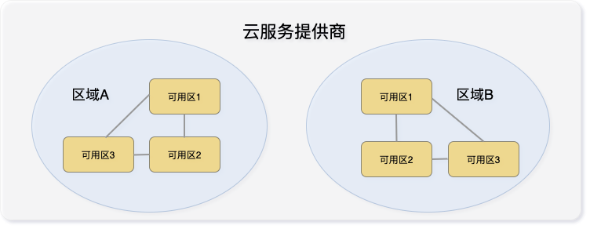

## 部署模式

!!! warning ""
    * 手动模式: 用户需要自己准备物理机或虚拟机,存储可选择 NFS 持久化存储，外部 ceph 存储等
    * 自动模式: 用户只需要绑定云平台（比如 VMware）账号信息，KubeOperator 会根据预先定义的部署计划来自动创建主机实现一键自动化部署

## 部署计划

!!! warning ""
    自动部署模式下，部署计划定 义了 Kubernetes 集群的部署细节，包括其部署模型、集群所在的区域、可用区、节点大小类型等

## 区域和可用区

!!! warning ""
    区域(Region)和可用区(AZ)这两个术语来自公有云。每个区域完全独立。每个可用区完全隔离，但同一个区域内的可用区之间使用低时延链路相连。区域和可用区之间的关系如下图所示

!!! warning ""
    对于公有云厂商提供的托管 Kubernetes 服务，master 节点由公有云厂商托管并维护，其 3 个master 节点会分布在同个区域下面的 3 个不同可用区上面，实现真正的高可用

!!! warning ""
    KubeOperator 借鉴公有云厂商的思路和概念，并应用到 VMware、Openstack 和 FusionCompute 等私有云平台上面。例如，在 VMware 云平台下，区域对应为 Datacenter，可用区对应于 cluster，或者 cluster 下面的 resource pool

!!! warning "注意事项"
    * 如果用户只有一个 vSphere 集群，那么可以在集群下面建立三个 resource pool，每个resource pool 对应于一个可用区
    * 如果用户有三个 vSphere 集群，那么每个集群对应于一个可用区  
    * vSAN 集群不能被多个 vSphere 集群共享，所以 3 个 vSphere 集群，持久化存储仅支持集中存储。 [具体请参考此文档](https://docs.vmware.com/en/VMware-Enterprise-PKS/1.5/vmware-enterprise-pks-15/GUID-vsphere-persistent-storage.html)

## 权限模型

!!! warning ""
    支持通过在项目中设置用户权限等级来管理集群，分为系统管理员、项目管理员、集群管理员

### 系统管理员

!!! warning ""
    默认的 admin 账号可以创建系统管理员

!!! warning ""
    * 管理集群，安装、卸载、升级、扩容、缩容、备份、恢复等等所有集群相关操作
    * 管理用户，添加系统管理员和普通用户
    * 管理项目，创建新项目，给项目创建集群、指定项目管理员和集群管理员、授权资源等
    * 管理版本，启用、禁用 k8s 版本、查看版本详情等
    * 管理资源，添加集群所需主机、部署计划、备份账号等
    * 系统设置，设置添加仓库、凭据、NTP、邮箱、License等
    * 查看系统日志

### 项目管理员

!!! warning ""
    * 管理集群，安装、卸载、升级、扩容、缩容、备份、恢复等所有集群相关操作
    * 查看版本，查看版本详情
    * 查看资源，查看集群所需主机、部署计划、备份账号等
    * 查看项目，查看项目管理员和集群管理员、已授权资源等
    * 查看系统日志

### 集群管理员

!!! warning ""
    * 管理集群，查看集群概览、监控、日志、事件、添加工具、启用CSI扫描等相关操作
    * 查看系统日志