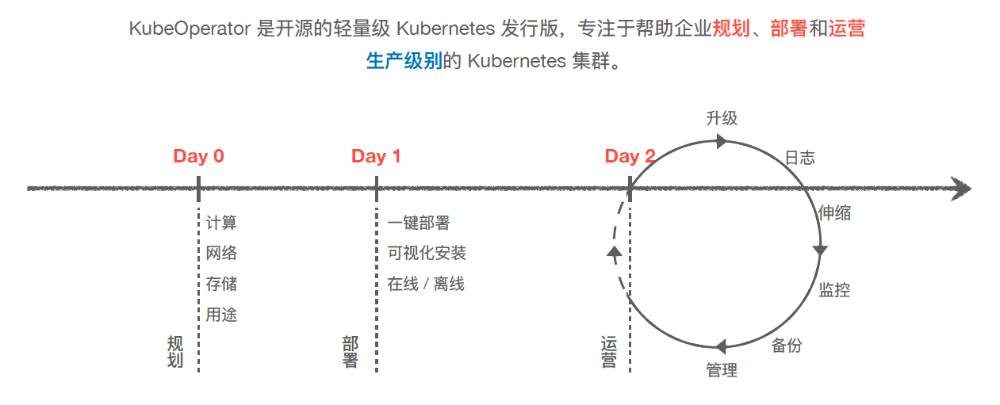
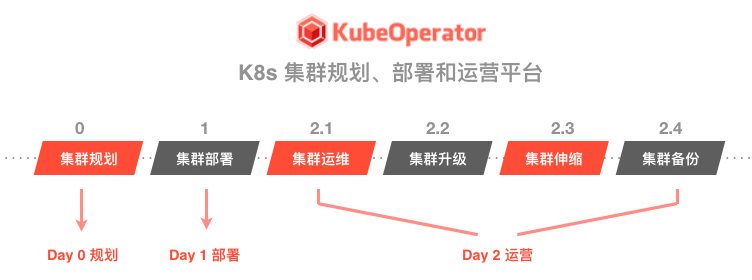
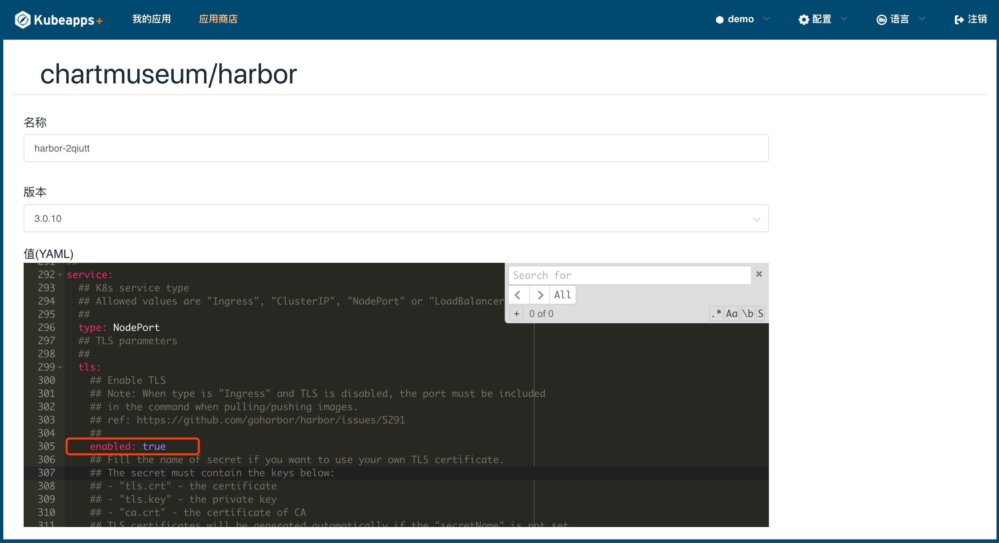
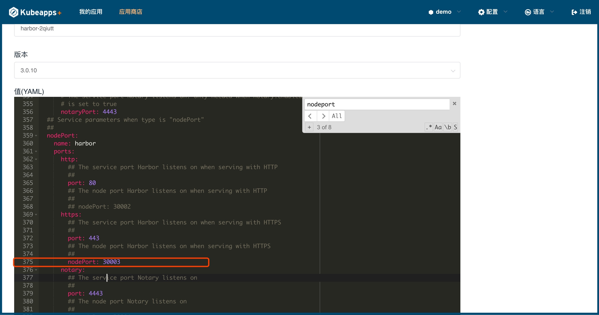
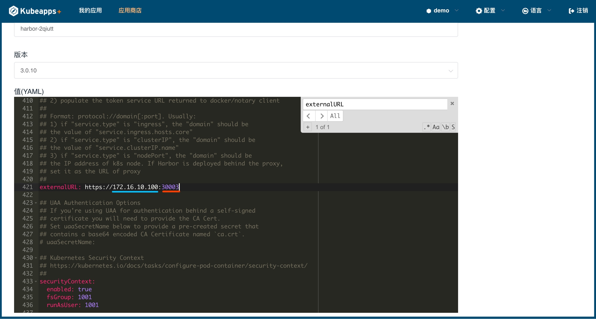

### KubeOperator 的定位

!!! warning ""
    KubeOperator 是一个开源的轻量级 Kubernetes 发行版。与 OpenShift 等重量级 PaaS 平台相比，KubeOperator 只专注于解决一个问题，就是帮助企业规划（Day 0）、部署（Day 1）、运营（Day 2）生产级别的 Kubernetes 集群，并且做到极致



!!! warning ""
    云原生正在快速兴起，三个互相关联的领域在同步进化：  

    -  基础设施方面: 从 物理资源 到 虚拟化资源 到 容器化（ Kubernetes ）资源 的演进
    -  开发模式方面: 从 瀑布模型 到 敏捷开发 到 DevOps 的演进
    -  应用架构方面: 从 单体架构 到 多层次架构 到 微服务 的演进

### 开源版和企业版的区别

=== "开源版本"
    !!! warning ""
        * 和同属飞致云旗下的 JumpServer 开源堡垒机一样，KubeOperator 的核心功能全部开源，坚持按月发布新版本，永久免费使用

=== "企业版本"
    !!! warning ""
        * 自定义 Logo 和 配色
        * 对接 LDAP
        * 增加消息中心
        * 支持邮箱、钉钉、企业微信告警
        * 集群健康评估
        * 对接 F5
        * 多集群配置管理

### 与其他工具的区别



=== "相同"
    !!! warning ""
        KubeOperator 不仅提供 Day 1 部署功能，还提供 Day 2 的 K8s 集群升级、扩容、监控、检查、备份恢复等功能

=== "差异"
    !!! warning ""
        KubeOperator 不仅支持安装程序本身，还提供了一组工具来监视 Kubernetes 集群的持续运行。KubeOperator 的优势包括:  

        -  提供可视化的 Web UI，大大降低部署和管理 Kubernetes 的门槛；
        -  提供离线的、经过全面验证和测试的安装包；
        -  与 VMware、Openstack 和 FusionCompute 等云平台紧密对接，能够实现一键虚机自动创建和部署（基于 Terraform 和 Ansible）；
        -  KubeOperator 会提供经过充分验证的成熟企业级存储和网络方案。

### Kubernetes 部署方案

=== "物理机"
    !!! warning ""
        - 基于物理机部署大的 Kubernetes 集群: 通过 namespace 实现租户的隔离
        - 如果是单一大集群，升级会影响所有租户，风险比较大

=== "IaaS"
    !!! warning ""
        - 基于 IaaS 平台之上部署多个 Kubernetes 集群: 为每个租户分配独立的 Kubernetes 集群
        - IaaS 平台上有成熟的、基于软件定义的存储和网络方案，落地更容易和灵活
        - KubeOperator 与 VMware、Openstack和 FusionCompute 等 IaaS 方案紧密集成，可以实现全栈的自动化，集群交付快，伸缩快

!!! warning "公有云注意仓库 IP 和 主机 IP 需要填写内网IP"

### KubeOperator 部署方式

!!! warning ""
    基于 kubeadm 容器化部署 Kubernetes 集群

### 原生 Kubernetes 的好处

!!! warning ""
    - KubeOperator 已经通过云原生基金会的 [Kubernetes 软件一致性认证](https://landscape.cncf.io)。
    - Kubernetes 迭代很快，且只维护最新的三个大版本。如果采纳其他发行版，可能很容易出现和原生版本脱节的情况。
    - 由于 Operator 和 Helm 等日趋成熟，很多发行版的功能，比如 CI/ CD, Istio 等都可以通过 addon 方式部署到 Kubernetes 集群里面。Kubernetes 集群及其里面的应用应该是分离的，各自迭代升级。

### KubeOperator 支持的存储

=== "NFS"
    !!! warning ""
        - 手动模式和自动模式下的集群都支持 NFS 作为持久化存储

=== "LocalStorage"
    !!! warning ""
        - 本地持久化存储

=== "External Ceph"
    !!! warning ""
        - 创建成功之后，会在集群中初始化 ceph provisioner 相关 pod

=== "Rook-Ceph"
    !!! warning ""
        - 需要指定 ceph 集群所需磁盘（集群所有节点都必须包含指定的磁盘，如sdb,sdc...）

=== "vSphere"
    !!! warning ""
        - 集群服务器必须在指定 Folder 中（自动模式创建集群默认 Folder 为 kubeoperator），并且服务器名称要和集群 node 节点名称保持一致

=== "[OceanStor](https://github.com/Huawei/eSDK_K8S_Plugin/tree/master/docs/zh)"

!!! warning "Static and Dynamic PVs 的支持情况取决于所选择的存储。以 vSphere 平台为例，[各种存储选项可以参考此文章](https://docs.vmware.com/en/VMware-Enterprise-PKS/1.5/vmware-enterprise-pks-15/GUID-vsphere-persistent-storage.html)"

### KubeOperator 其他说明

!!! warning ""
    - 自身重启、升级或者挂掉不会影响其创建和管理的 Kubernetes 集群。KubeOperator 是一个 100% 旁路系统，其与被管 Kubernetes 集群完全解耦。
    - 重启 KubeOperator 部署的 Kubernetes 集群的节点后，比如 Master 或者 Worker 节点，会自动恢复正常。

### 支持的 vSphere 版本
!!! warning ""
    - 如果是手动部署模式 + NFS，支持 vSphere 5.5 及以上版本。
    - 如果是自动模式 + vSAN，支持 vSphere 6.5 及以上版本

### Harbor 访问故障
    - 可以通过 Web UI 访问，但是 docker login 不成功
    - 以默认的 NodePort 访问为例

!!! warning ""
    - 上传 Harbor 离线应用到应用商店
    - 点击 Harbor 进行部署
    - 部署前对 value.yaml 做以下修改

=== "第一步"
    !!! warning ""
        - 开启 TLS，修改 enable = true
    

=== "第二步"
    !!! warning ""
        - 配置一个固定的 NodePort 端口，端口不要和现有环境冲突即可
    

=== "第三步"
    !!! warning ""
        - 修改 externalURL: https://worker:port , 如图: 172.16.10.100是 worker 节点的IP，30003 是第二个步骤中为 NodePort 设置的固定端口
    

!!! warning ""
    - 点就右上角“部署”按钮，进行部署

!!! warning ""
    - 在本地 Docker 客户端配置 daemon.json,使之信任 Harbor 私有仓库
    ```yaml
    {
      ...
      "insecure-registries" : [
        "172.16.10.100:30003"
      ]
      ...
    }
    ```

!!! warning ""
    - 在本地进行 docker login ，使用正确的用户名和密码进行登录
    ```sh
    $ docker login 172.16.10.100:30003
    Username: admin
    Password:
    Login Succeeded
    ```

!!! warning "不论用 Ingress 还是 ClusterIP 对 Harbor 进行服务暴露，externalURL 一定要和实际访问 Harbor 时的 URL 一致，否则 docker login 认证时将会失败"
