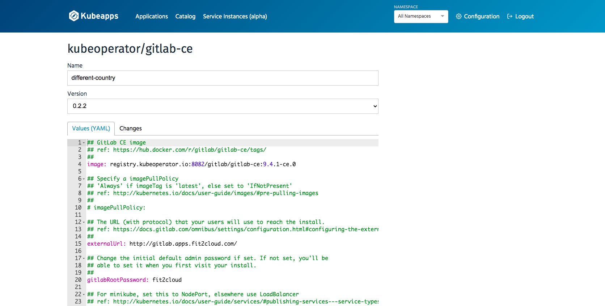

# Kubeapps 使用指南

## 什么是 KubeApps ？

Kubeapps 是一个应用商店，可以通过 Web UI 在 Kubernetes 集群中部署和管理应用程序。KubeApps 的主要功能包括：

- 从 Helm Chart 仓库中浏览并部署 Helm Chart 应用；
- 集群中已有 Helm chart 应用的查看、升级和卸载；
- 支持自定义 Helm Chart 仓库（比如 ChartMuseum 和 JFrog Artifactory 等）；
- 基于 Kubernetes RBAC 的身份验证和授权；

## 安装 KubeApps

进入目标集群，在【工具】tab页面点击启用 KubeApps。根据需要自定义存储。


## 使用 KubeApps 

KubeApps 安装完成后，单击 转到 按钮，可以安全地访问 KubeApps Dashboard。


 ### 部署应用

在 Dashboard 中的【Catalog】页中可以看到系统默认自带的应用，可选择一个应用程序部署。 本文以部署 GitLab 应用为例说明。


首选根据用户需要选择一个 namespace，这里选择 kube-operator，然后单击部署应用，可以看到【应用商店】里面目前支持的应用列表。选择 GitLab 应用后,在应用页面右侧单击“Deploy”按钮。


系统将提示输入应用程序的名称，还可以看到目前版本，以及 GitLab 应用 YAML 配置文件，用户可根据自身需求修改该配置文件。



> 注: 根据实际情况，自定义存储（storageClass）、Ingress等变量

在最下面点击 “Submit” 按钮。 该应用程序将被部署。 部署成功后，应用变为就绪状态。
要获取 GitLab 用户名和密码, 请参考部署页面的 “Notes” 部分, 其中包含 GitLab 的 URL、账号及密码信息。注意: 如果 Serice 类型为 Ingress，要将该 URL 添加到本地 hosts 解析。


### 删除应用

部署完成的应用如果要删除，可以在【Applications】进入 GitLab 应用后，单击右侧 “Delete” 按钮确定即可删除。


## 添加存储库

KubeApps 支持添加外部应用仓库，在【Configuration】下拉菜单“App Repositories“页面，单击“Add App Repository”。
输入 Name 和 URL ，Install Repo 后在应用商店页使用新添加仓库里面的应用。


## 安装离线包（可选）

离线包包括 Argo CD、Gitlab、Harbor、Jenkins 和 Sonarqube 镜像，用户可以根据需要下载并安装。

- 下载链接: https://github.com/KubeOperator/charts/releases

#### 安装步骤:

```bash
# 首先登录 kubeoperator 部署机，进入 /tmp (或其他自定义)目录，将离线包拷贝到该目录中。
cd /tmp
# 解压文件到本目录。
tar zxvf gitlab.tar.gz && cd gitlab
# 执行 install.sh 文件，将镜像推送到nexus仓库。
bash install.sh
```
