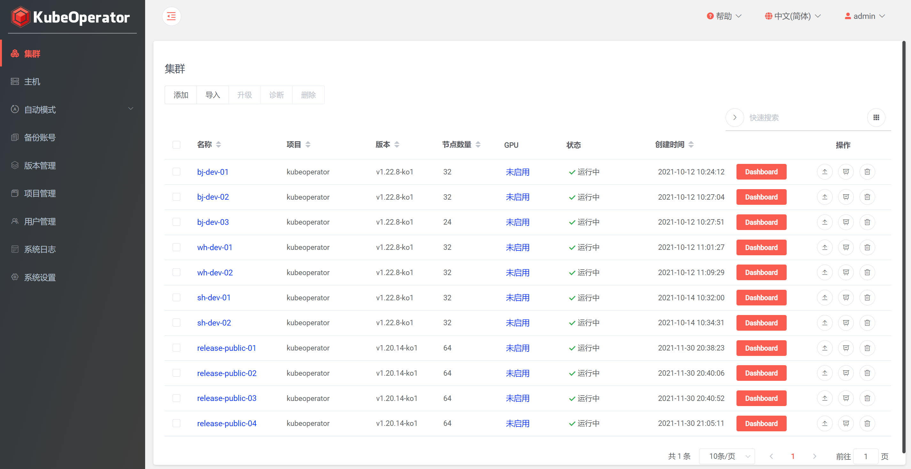

# 总体介绍

!!! warning ""
    [KubeOperator][KubeOperator] 是一个开源的轻量级 [Kubernetes][Kubernetes] 发行版，专注于帮助企业规划、部署和运营生产级别的 [Kubernetes][Kubernetes] 集群。

    [KubeOperator][KubeOperator] 提供可视化的 Web UI，支持离线环境，支持物理机、[VMware][VMware]、[OpenStack][OpenStack] 和 [FusionCompute][FusionCompute] 等 IaaS 平台，支持 x86 和 ARM64 架构，支持 GPU，内置应用商店，已通过 CNCF 的 [Kubernetes][Kubernetes] 软件一致性认证。  

    [KubeOperator][KubeOperator] 使用 [Terraform][Terraform] 在 IaaS 平台上自动创建主机（用户也可以自行准备主机，比如物理机或者虚机），通过 [Ansible][Ansible] 完成自动化部署和变更操作，支持 [Kubernetes][Kubernetes] 集群 从 Day 0 规划，到 Day 1 部署，到 Day 2 运营的全生命周期管理。  

## 页面展示

## 技术优势

!!! warning ""

    -  按需创建: 调用云平台 API，一键快速创建和部署 [Kubernetes][Kubernetes] 集群
    -  按需伸缩: 快速伸缩 [Kubernetes][Kubernetes] 集群，优化资源使用效率
    -  按需修补: 快速升级和修补 [Kubernetes][Kubernetes] 集群，并与社区最新版本同步，保证安全性
    -  离线部署: 支持完全离线下的 [Kubernetes][Kubernetes] 集群部署
    -  自我修复: 通过重建故障节点确保集群可用性
    -  全栈监控: 提供从Pod、Node到集群的事件、监控、告警、和日志方案
    -  Multi-AZ 支持: 将 Master 节点分布在不同的故障域上确保集群高可用
