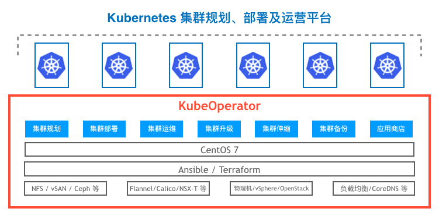

# 关于 KubeOperator

## 1 什么是 KubeOperator？

KubeOperator 是一个开源项目，在离线网络环境下，通过可视化 Web UI 在 VMware、Openstack 或者物理机上规划、部署和运营生产级别的 Kubernetes 集群。KubeOperator 是 [JumpServer](https://github.com/jumpserver/jumpserver) 明星开源团队在 Kubernetes 领域的的又一全新力作。

KubeOperator 使用 Terraform 在 IaaS 平台上自动创建主机（用户也可以自行准备主机，比如物理机或者虚机），通过 Ansible 完成自动化部署和变更操作，支持 Kubernetes 集群 从 Day 0 规划，到 Day 1 部署，到 Day 2 运营的全生命周期管理。

KubeOperator 内置 [kubeapps](https://github.com/kubeapps/kubeapps) 应用商店，以支撑各种基于 K8s 的应用场景，如: 

- CI / CD 应用场景: GitLab、Jenkins、Harbor、Sonarqube、Argo CD 等；
- GPU / AI 应用场景: Tensorflow、PyTorch 等;
- Serverless 应用场景: Knative 等；
- 数据库应用场景: MySQL、Redis 等;

KubeOperator 的整体架构如下图所示: 

> 注:  KubeOperator 已通过云原生基金会（CNCF）的 [Kubernetes 软件一致性认证](https://landscape.cncf.io/selected=kube-operator)。

## 2 KubeOperator 的技术优势

-  简单易用: 提供可视化的 Web UI，极大降低 K8s 部署和管理门槛，内置 [Webkubectl](https://github.com/KubeOperator/webkubectl)；
-  离线部署: 持续更新包括 Kubernetes 及常用组件的离线包；
-  按需创建: 调用云平台 API，一键快速创建和部署 Kubernetes 集群；
-  按需伸缩: 快速伸缩 Kubernetes 集群，优化资源使用效率；
-  按需修补: 快速升级和修补 Kubernetes 集群，并与社区最新版本同步，保证安全性；
-  自我修复: 通过重建故障节点确保集群可用性；
-  全栈监控: 提供从Pod、Node到集群的事件、监控、告警、和日志方案；
-  Multi-AZ 支持: 将 Master 节点分布在不同的故障域上确保集群高可用；
-  应用商店: 内置 [KubeApps Plus](https://github.com/KubeOperator/kubeapps-plus) 应用商店，快速部署和管理常见应用；
-  GPU 支持: 支持 GPU 节点，助力运行深度学习等应用；

## 3 KubeOperator 的功能列表

<table>
    <tr>
        <td rowspan="14">Day 0 规划</td>
        <td rowspan="2">集群模式</td>
        <td>1 个 Master 节点 n 个 Worker 节点模式: 适合开发测试用途</td>       
    </tr>
    <tr>
        <td>3 个 Master 节点 n 个 Worker 节点模式: 适合生产用途</td>
    </tr>    
    <tr>
        <td rowspan="3">计算方案</td>
        <td>独立主机: 支持自行准备的虚机、公有云主机和物理机</td>  
    </tr>    
    <tr>
        <td>vSphere 平台: 支持自动创建主机（使用 Terraform）</td>
    </tr>
    <tr>
        <td>Openstack 平台: 支持自动创建主机 （使用 Terraform）</td>
    </tr>
    <tr>
        <td rowspan="3">存储方案</td>
        <td>独立主机: 支持 NFS / Ceph RBD / Local Volume</td>
    </tr>
    <tr>
        <td>vSphere 平台: 支持 vSphere Datastore （vSAN 及 vSphere 兼容的集中存储）</td>
    </tr> 
     <tr>
        <td>Openstack 平台: 支持 Openstack Cinder （Ceph 及 Cinder 兼容的集中存储）</td>
    </tr>
    <tr>
        <td rowspan="4">网络方案</td>
        <td>支持 Flannel / Calico 网络插件</td>
    </tr>
    <tr>
        <td>支持通过 F5 Big IP 对外暴露服务</td>
    </tr> 
    <tr>
        <td>支持 Traefik</td>
    </tr>    
    <tr>
        <td>支持 CoreDNS</td>
    </tr>
    <tr>
        <td>GPU 方案</td>
        <td>支持 NVIDIA GPU</td>
    </tr> 
    <tr>
        <td>操作系统</td>
        <td>支持 CentOS 7.4 / 7.5 / 7.6 / 7.7</td>
    </tr>    
    <tr>
        <td class="features-first-td-background-style" rowspan="3">Day 1 部署</td>
        <td rowspan="3">部署</td>  
        <td>提供离线环境下的完整安装包</td>         
    </tr>
     <tr>
        <td>支持可视化方式展示部署过程</td>
    </tr>
     <tr>
        <td>支持一键自动化部署（使用 Ansible）</td>
    </tr> 
    <tr>
        <td class="features-first-td-background-style" rowspan="15">Day 2 运营</td>
        <td rowspan="6">管理</td>  
        <td>支持用户权限管理，支持对接 LDAP/AD</td>         
    </tr>
    <tr>
        <td>对外开放 REST API</td>
    </tr>    
    <tr>
        <td>内置 K8s Dashboard 管理应用</td>
    </tr>     
     <tr>
        <td>内置 Weave Scope 管理应用</td>
    </tr>  
    <tr>
        <td>提供 Web Kubectl 界面</td>
    </tr> 
    <tr>
        <td>内置 Helm </td>
    </tr>   
    <tr>
        <td rowspan="4">可观察性</td>
        <td>内置 Promethus，支持对集群、节点、Pod、Container的全方位监控和告警</td>
    </tr>
     <tr>
        <td>内置 Loki 日志方案</td>
    </tr> 
    <tr>
        <td>内置 Grafana 作为监控和日志展示</td>
    </tr> 
    <tr>
        <td>支持消息中心，通过钉钉、微信通知各种集群异常事件</td>
    </tr>      
    <tr>
        <td>升级</td>
        <td>支持集群升级</td>
    </tr> 
    <tr>
        <td>伸缩</td>
        <td>支持增加或者减少 Worker 节点</td>
    </tr>
    <tr>
        <td>备份</td>
        <td>支持 etcd 定期备份</td>
    </tr>  
    <tr>
        <td>合规</td>
        <td>支持集群合规检查并可视化展示结果</td>
    </tr>      
     <tr>
        <td>应用商店</td>
        <td>集成 KubeApps Plus 应用商店，快速部署 CI/CD、AI 深度学习等应用</td>
    </tr>     
 </table>

具体版本路线图请参考: [Roadmap](https://github.com/KubeOperator/KubeOperator/blob/master/ROADMAP.md)
