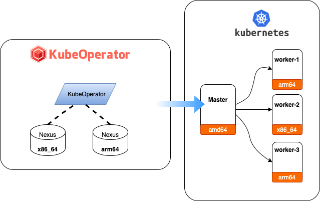

## 硬件要求

=== "最小化配置"

    <table>
        <thead>
            <tr>
                <th>角色</th>
                <th>CPU核数</th>
                <th>内存</th>
                <th>系统盘</th>
                <th>数量</th>
            </tr>
        </thead>
        <tbody>
            <tr>
                <td>部署机</td>
                <td>4</td>
                <td>8G</td>
                <td>100G</td>
                <td>1</td>
            </tr>
            <tr>
                <td>Master</td>
                <td>4</td>
                <td>8G</td>
                <td>100G</td>
                <td>1</td>
            </tr>
            <tr>
                <td>Worker</td>
                <td>4</td>
                <td>8G</td>
                <td>100G</td>
                <td>1</td>
            </tr>
        <tbody>
    </table>

=== "推荐配置"

    <table>
        <thead>
            <tr>
                <th>角色</th>
                <th>CPU核数</th>
                <th>内存</th>
                <th>系统盘</th>
                <th>数量</th>
            </tr>
        </thead>
        <tbody>
            <tr>
                <td>部署机</td>
                <td>8</td>
                <td>16G</td>
                <td>100G SSD</td>
                <td>1</td>
            </tr>
            <tr>
                <td>Master</td>
                <td>8</td>
                <td>16G</td>
                <td>100G SSD</td>
                <td>3</td>
            </tr>
            <tr>
                <td>Worker</td>
                <td>8</td>
                <td>16G</td>
                <td>系统盘: 100G<br>
                    数据盘: 300G（/var/lib/docker）</td>
                <td>>3</td>
            </tr>
        </tbody>
    </table>

## 软件要求

=== "kubeoperator 部署机"

    <table>
        <thead>
            <tr>
                <th>需求项</th>
                <th>具体要求</th>
                <th>参考（以CentOS7.6为例）</th>
            </tr>
        </thead>
        <tbody>
            <tr>
                <td>操作系统</td>
                <td>支持 Docker 的 Linux OS</td>
                <td>cat /etc/redhat-release</td>
            </tr>
            <tr>
                <td>CPU 架构</td>
                <td>支持 x86_64 和 aarch64 </td>
            <td>uname -m</td>
            </tr>
            <tr>
                <td>kernel 版本</td>
                <td>>=Linux 3.10.0-957.el7.x86_64</td>
                <td>uname -sr</td>
            </tr>
            <tr>
                <td>swap</td>
                <td>关闭</td>
                <td>swapoff -a<br>
                    sed -i '/ swap / s/^\(.*\)$/#\1/g' /etc/fstab</td>
            </tr>
            <tr>
                <td>防火墙</td>
                <td>关闭</td>
                <td>systemctl stop firewalld && systemctl disable firewalld</td>
            </tr>
            <tr>
                <td>端口</td>
                <td>所有节点防火墙必须放通 SSH（默认22）、80、8081-8083端口</td>
                <td>firewall-cmd --zone=public --add-port=80/tcp --permanent</td>
            </tr>
            <tr>
                <td>SELinux</td>
                <td>关闭</td>
                <td>setenforce 0<br>
                    sed -i "s/SELINUX=enforcing/SELINUX=disabled/g" /etc/selinux/config</td>
            </tr>
        </tbody>
    </table>

=== "kubernetes 集群节点"

    <table>
        <thead>
            <tr>
                <th>需求项</th>
                <th>具体要求</th>
                <th>参考（以CentOS7.6为例）</th>
            </tr>
        </thead>
        <tbody>
            <tr>
                <td>操作系统</td>
                <td><b>CentOS/RHEL 7.4 - 7.9 Minimal<br>
                    Ubuntu 12.04 / 18.04<br>
                    EulerOS 2.5（x86_64）<br>
                    EulerOS 2.8（arm64）<br>
                    银河麒麟操作系统v10</b></td>
                <td>cat /etc/redhat-release</td>
            </tr>
            <tr>
                <td>CPU 架构</td>
                <td>支持 x86_64 和 aarch64 </td>
            <td>uname -m</td>
            </tr>
            <tr>
                <td>kernel 版本</td>
                <td>>=Linux 3.10.0-957.el7.x86_64</td>
                <td>uname -sr</td>
            </tr>
            <tr>
                <td>swap</td>
                <td>关闭。如果不满足，系统会有一定几率出现 io 飙升，造成 docker 卡死。kubelet 会启动失败(可以设置 kubelet 启动参数 --fail-swap-on 为 false 关闭 swap 检查)</td>
                <td>swapoff -a<br>
                    sed -i '/ swap / s/^\(.*\)$/#\1/g' /etc/fstab</td>
            </tr>
            <tr>
                <td>防火墙</td>
                <td>关闭。Kubernetes 官方要求</td>
                <td>systemctl stop firewalld && systemctl disable firewalld</td>
            </tr>
            <tr>
                <td>SELinux</td>
                <td>关闭</td>
                <td>setenforce 0<br>
                    sed -i "s/SELINUX=enforcing/SELINUX=disabled/g" /etc/selinux/config</td>
            </tr>
            <tr>
                <td>时区</td>
                <td>所有服务器时区必须统一，建议设置为 Asia/Shanghai</td>
                <td>timedatectl set-timezone Asia/Shanghai</td>
            </tr>
        </tbody>
    </table>

## 安装说明

=== "离线安装"

    !!! info "请自行下载 KubeOperator [最新版本的离线安装包](https://community.fit2cloud.com/#/products/kubeoperator/downloads)"

    !!! info ""
        ```sh
        # 解压安装包
        tar zxvf KubeOperator-release-{{ kubeoperator.version }}-amd64.tar.gz
        # arm64 的包名是 KubeOperator-release-{{ kubeoperator.version }}-arm64.tar.gz
        cd KubeOperator-release-{{ kubeoperator.version }}
        # 运行安装脚本
        /bin/bash install.sh
        # 等待安装脚本执行完成后，查看 KubeOperator 状态
        koctl status
        ```

=== "在线安装"

    !!! info "默认使用 /opt/kubeoperator 目录作为安装目录，配置文件、数据及日志等均存放在该安装目录安装完成后，安装过程中产生的离线文件可删除，目录名: kubeoperator-release-{{ kubeoperator.version }}"

    !!! info ""
        ```sh
        # 以 root 用户 ssh 登录目标服务器, 执行如下命令
        curl -sSL https://github.com/KubeOperator/KubeOperator/releases/latest/download/quick_start.sh -o quick_start.sh
        bash quick_start.sh
        ```

!!! info "安装完成后，检查服务状态。若有有异常，可以使用 koctl restart 命令进行重新启动"

!!! info ""
    ```
    [root@kubeoperator ~]# koctl status

              Name                        Command                  State                                       Ports
    ------------------------------------------------------------------------------------------------------------------------------------------------
    kubeoperator_kobe         sh /root/entrypoint.sh           Up (healthy)   8080/tcp
    kubeoperator_kotf         kotf-server                      Up (healthy)   8080/tcp
    kubeoperator_kubepi       kubepi-server                    Up (healthy)   80/tcp
    kubeoperator_mysql        /entrypoint.sh mysqld            Up (healthy)   3306/tcp, 33060/tcp
    kubeoperator_nexus        sh -c ${SONATYPE_DIR}/star ...   Up (healthy)   0.0.0.0:8081->8081/tcp, 0.0.0.0:8082->8082/tcp, 0.0.0.0:8083->8083/tcp
    kubeoperator_nginx        /docker-entrypoint.sh ngin ...   Up (healthy)   0.0.0.0:80->80/tcp
    kubeoperator_server       ko-server                        Up (healthy)   8080/tcp
    kubeoperator_ui           /docker-entrypoint.sh ngin ...   Up (healthy)   80/tcp
    kubeoperator_webkubectl   sh /opt/webkubectl/start-w ...   Up (healthy)
    ```

!!! info "登录"
    ```
    地址: http://<ko服务器_ip>:80
    用户名: admin
    密码: kubeoperator@admin123
    ```

!!! info "帮助"
    ```sh
    koctl --help
    ```

## 升级说明

=== "离线升级"

    !!! info ""
        ```sh
        # 离线升级需要提前下载离线安装包，并解压到 KubeOperator 部署机
        # 进入升级包目录
        cd KubeOperator-release-{{ kubeoperator.version }}
        # 运行安装脚本
        ./koctl upgrade
        # 查看 KubeOperator 状态
        koctl status
        ```

=== "在线升级"

    !!! info ""
        ```sh
        # 升级到指定版本
        koctl upgrade {{ kubeoperator.version }}
        # 升级到最新版本
        koctl upgrade
        # 查看 KubeOperator 状态
        koctl status
        ```

## 混合架构说明

!!! info "定义：混合架构是指使用 KubeOperator 部署同时包含 x86_64 和 arm64 架构节点的 Kubernetes 集群"

!!! info ""   
    如下图所示，混合部署需要提供 x86_64 和 arm64 架构的 nexus 仓库，以便于集群部署时可以下载到对应架构的资源，之后在 KubeOperator 系统设置添加不同架构的仓库信息即可。</br>

    例如：</br>
    &#x2003 1.可以分别部署两台不同架构的 KubeOperator（一台 arm64,一台 x86_64）</br>&#x2003 2.使用 x86_64 架构的主机作为日常操作的主机</br>&#x2003 3.将 arm64 的主机作为 arm 仓库使用并添加到 x86_64 的 KubeOperator 系统设置中


