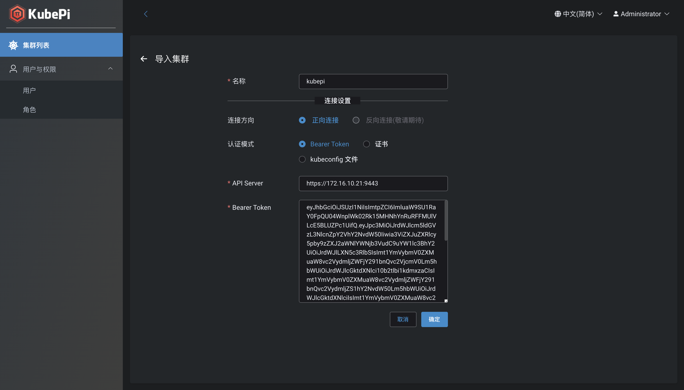
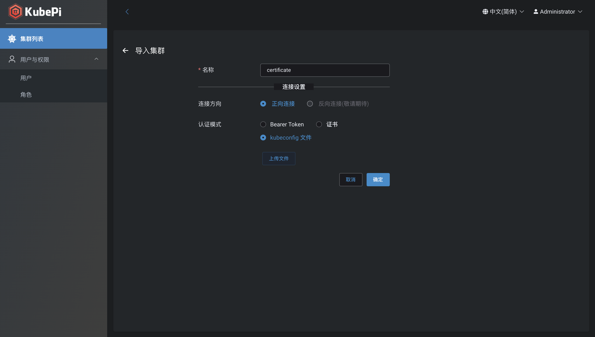
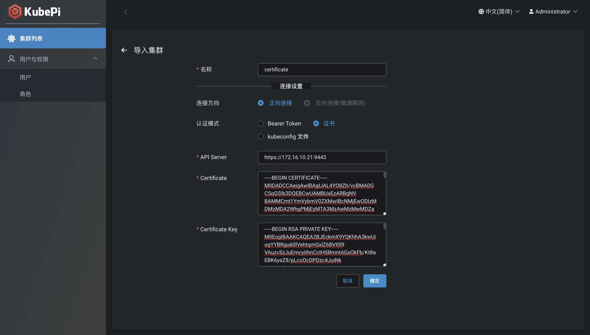
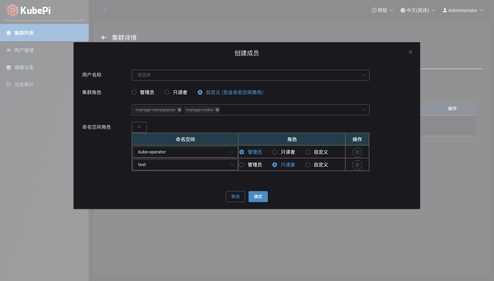

## 集群导入

!!! warning ""
    - [KubePi][KubePi] 支持的 [Kubernetes][Kubernetes] 版本: v1.16 ~ v1.20
    - 导入集群支持 Bearer Token、 kubeconfig 文件、证书三种方式

### Bearer Token

!!! warning "获取 apiserver 地址"
    - cat /root/.kube/config | grep server: | awk '{print $2}'
    - 注意: 如果 server IP 为 127.0.0.1，需要将 IP 替换为任意 master 节点 IP

!!! warning "获取 Token"

    === "默认"

        !!! warning ""

            [KubeOperator][KubeOperator] 部署的 [Kubernetes][Kubernetes] 集群，可在集群任意节点上执行如下命令

            ```shell
            kubectl -n kube-system describe secret $(kubectl -n kube-system get secret | grep ko-admin | awk '{print $1}') | grep token: | awk '{print $2}'
            ```

        !!! warning ""

            [Kubectl][Kubectl] 方式部署的 [KubePi][KubePi] 服务，在集群任意节点上执行如下命令

            ```shell
            kubectl -n kube-system describe secret $(kubectl -n kube-system get secret | grep kubepi-user | awk '{print $1}') | grep token: | awk '{print $2}'
            ```

    === "自定义"
        
        !!! warning ""
            创建 Service Account

            ```yaml
            apiVersion: v1
            kind: ServiceAccount
            metadata:
              name: kubepi-user
              namespace: kube-system
            ```

        !!! warning ""
            创建 ClusterRoleBinding

            ```yaml
            apiVersion: rbac.authorization.k8s.io/v1
            kind: ClusterRoleBinding
            metadata:
              name: kubepi-user
            roleRef:
              apiGroup: rbac.authorization.k8s.io
              kind: ClusterRole
              name: cluster-admin
            subjects:
              - kind: ServiceAccount
                name: kubepi-user
                namespace: kube-system
            ```

        !!! warning ""
            获取 Token

            ```shell
            kubectl -n kube-system describe secret $(kubectl -n kube-system get secret | grep kubepi-user | awk '{print $1}') | grep token: | awk '{print $2}'
            ```



### kubeconfig

!!! warning ""
    - kubeconfig 文件默认路径为: /root/.kube/config，可以将 config 文件拷贝到本机后导入
    - 注意: 如果 server IP 为 127.0.0.1，需要将 IP 替换为任意 master 节点 IP



### 证书



## 集群授权

!!! warning ""
    集群列表页点击授权按钮，支持将不同的用户添加为集群成员，并为其指定集群角色和命名空间角色



### 成员

!!! warning ""
    可将用户指定为集群管理员、只读者或者自定义权限。自定义权限需要为用户指定集群角色和命名空间角色。

!!! warning "集群角色"
    - 管理员: 拥有集群所有资源的操作权限
    - 只读者: 拥有集群所有资源的只读权限
    - 自定义: 拥有集群指定资源的指定权限

!!! warning "命名空间角色"
    - 管理员: 拥有指定 namespace 下所有资源的操作权限
    - 只读者: 拥有指定 namespace 下所有资源的只读权限
    - 自定义: 拥有指定 namespace 下指定资源的指定权限

### 角色

!!! warning "集群角色"
    - cluster-owner: 集群拥有者,拥有所有对象权限
    - cluster-viewer: 集群只读用户,拥有所有对象的只读权限
    - manage-cluster-rbac: 集群访问控制管理员, 拥有 ClusterRole、ClusterRoleBinding 对象的所有权限
    - manage-cluster-storage: 集群存储管理员,拥有 StorageClass、PersistentVolume 对象的所有权限
    - manage-crd: 自定义资源管理员,拥有 CustomResourceDefinition 对象的所有权限
    - manage-namespaces: 命名空间管理员,拥有对 Namespace 对象的所有权限
    - manage-nodes: 节点管理员,拥有 Node 对象的只读权限
    - view-cluster-rbac: 集群访问控制只读用户, 拥有 ClusterRole、ClusterRoleBinding 对象的只读权限
    - view-cluster-storage: 集群存储只读用户,拥有 StorageClass、PersistentVolume 对象的只读权限
    - view-crd: 自定义资源管理员,拥有 CustomResourceDefinition 对象的只读权限
    - view-events: 集群事件只读用户, 拥有 Events 对象的只读权限
    - view-namespaces: 命名空间只读用户,拥有对 Namespace 对象的所有权限
    - view-nodes: 节点只读用户,拥有 Node 对象的只读权限

!!! warning "命名空间角色"
    - manage-config: 配置管理员, 拥有当前命名空间 ConfigMap、Secret、ResourceQuotas、LimitRanges、HorizontalPodAutoscalers 和 PodDisruptionBudget 对象的所有权限
    - manage-rbac: 命名空间访问控制,拥有当前命名空间内 Role、RoleBinding 和 ServiceAccount 对象的所有权限
    - manage-service-discovery: 服务发现管理员,拥有当前命名空间内 Service、Endpoint、Ingress和NetworkPolicy 对象的所有权限
    - manage-storage: 存储管理员，拥有当前命名空间内 PersistentVolumeClaim 对象的所有权限
    - manage-workload: 工作负载管理员,工作负载只读用户，拥有当前命名空间内 DaemonSet、StatefulSet、Deployment、Job、CronJob和Pod的所有权限
    - namespace-owner: 命名空间拥有者，拥有当前命名空间内的所有对象的所有权限
    - namespace-viewer: 命名空间只读用户，拥有当前命名空间内的所有对象的只读权限
    - view-config: 配置只读用户, 拥有当前命名空间 ConfigMap、Secret、ResourceQuotas、LimitRanges、HorizontalPodAutoscalers 和 PodDisruptionBudget 对象的只读权限
    - view-rbac: 命名空间访问控制 只读用户,拥有当前命名空间内 Role、RoleBinding 和 ServiceAccount 对象的只读权限
    - view-service-discovery: 服务发现只读用户,拥有当前命名空间内 Service、Endpoint、Ingress和NetworkPolicy 对象的只读权限
    - view-storage: 存储只读用户，拥有当前命名空间内 PersistentVolumeClaim 对象的只读权限
    - view-workload: 工作负载只读用户，拥有当前命名空间内 DaemonSet、StatefulSet、Deployment、Job、CronJob和Pod的只读权限

[KubePi]:https://kubeoperator.io
[Kubectl]:https://github.com/KubeOperator/KubePi/tree/master/docs/deploy/kubectl
[KubeOperator]:https://github.com/KubeOperator/KubeOperator
[Kubernetes]:https://kubernetes.io