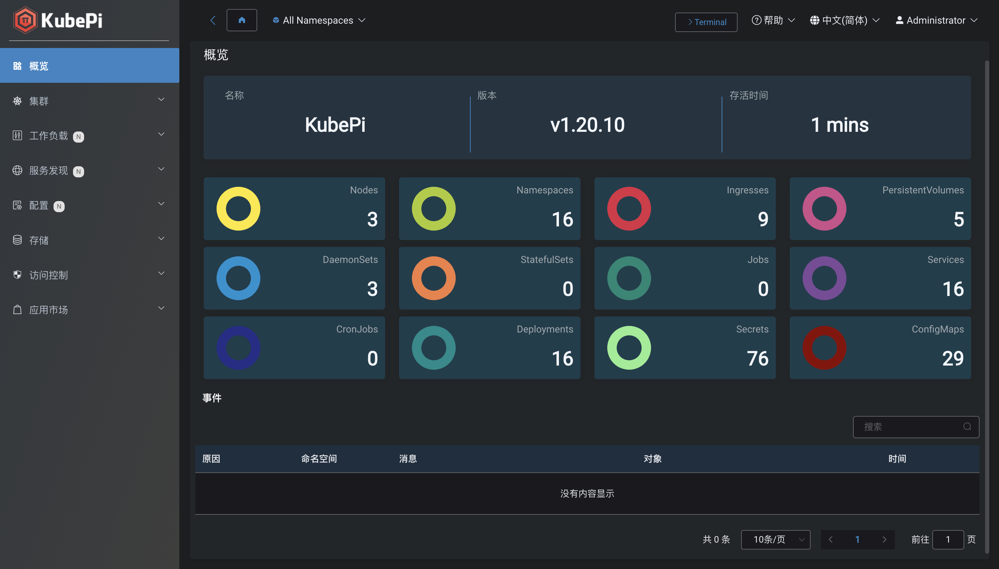
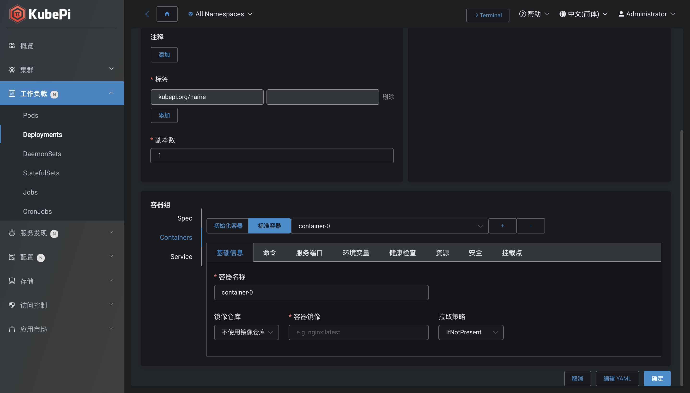
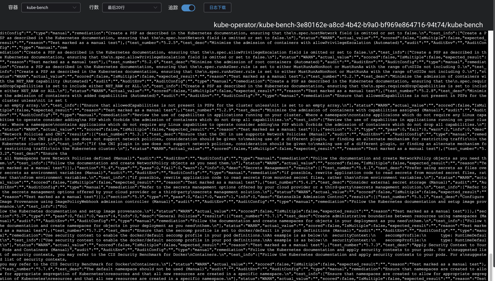

## 概览

## 工作负载

!!! warning ""
    - 图形化的工作负载编辑界面，让开发人员无需编写 Yaml 便可轻松、直观的完成应用的部署和管理。
    - 支持 Yaml 文件导入导出、工作负载弹性伸缩、重启、快速更换镜像版本等功能。
    - 当前支持表单创建的资源对象包括：NameSpace、Deployment、StatefulSet、DaemonSet、Job、CronJob、Service、Ingress、Engress、ConfigMap、Secret、PersistentVolumeClaim、PersistentVolume、Role、RoleBinding、ClusterRole、ClusterRoleBinding。

## 终端与日志

!!! warning ""
    - 支持查看 Pod 指定容器日志，支持日志追踪和快速切换容器
    - 支持针对 Pod 指定容器执行 Shell 操作

