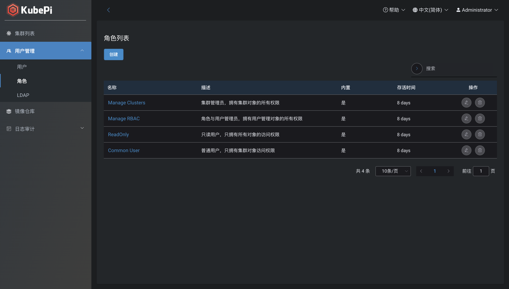
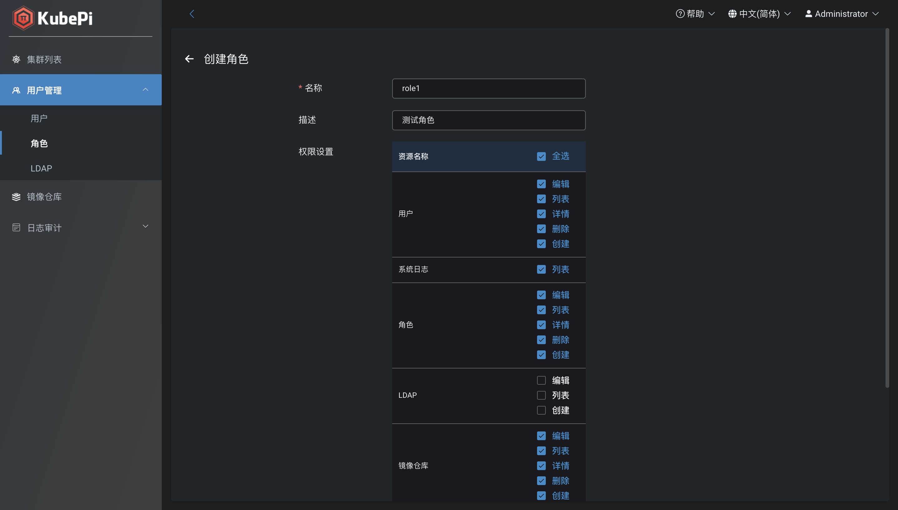

## 用户

!!! warning ""
    系统会初始化 admin 超级管理员（默认密码 kubepi），拥有系统所有资源的管理权限

### 创建用户

!!! warning ""
    创建用户user1，拥有集群管理员和角色与用户管理员角色

## 角色

!!! warning ""
    - Manage Clusters: 集群管理员，拥有集群对象的所有权限
    - Manage RBAC: 角色与用户管理员，拥有角色和用户对象的所有权限
    - ReadOnly: 只读用户，只拥有所有对象的访问权限
    - Common User: 普通用户，只拥有集群对象访问权限

### 创建角色

!!! warning ""
    创建角色role1，拥有集群、用户、角色的所有操作权限

