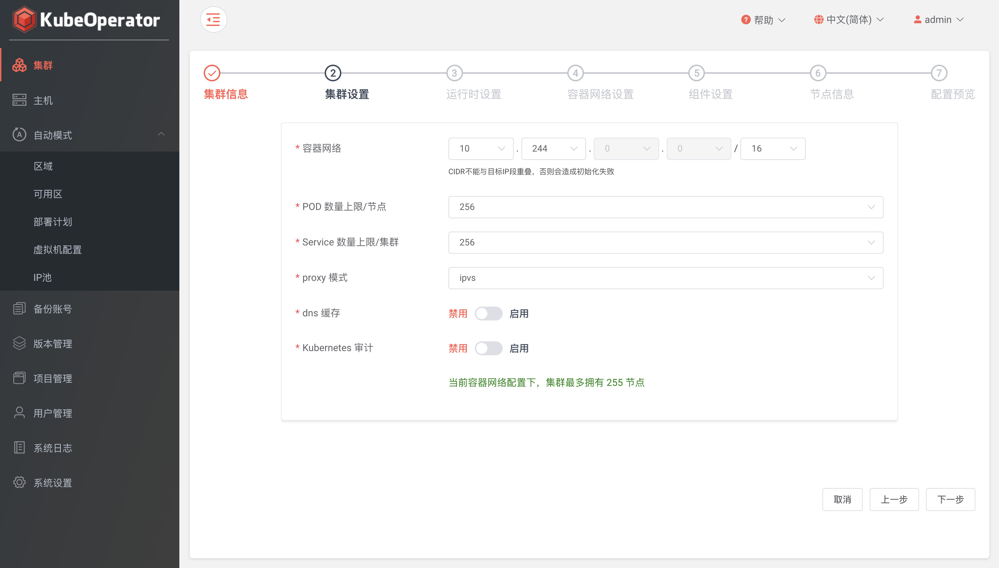

> 我们为用户准备了可以快速部署 KubeOperator 所有组件及所需的中间件的在线安装脚本, 你可以通过该脚本部署并体验 KubeOperator 所提供的功能

!!! warning "注意"
    快速安装脚本需要从互联网下载离线安装包，安装期间请保持网络通畅！

## 部署服务器要求

!!! info "部署服务器要求"
    * 操作系统: 任何支持 Docker 的 Linux x86_64
    * CPU/内存: 4核8G
    * 磁盘空间: 50G
    * 可访问互联网
    * 防火墙或安全组需开放端口: 80、8081-8083

## 安装步骤

### 执行安装脚本
> 以 root 用户 ssh 登录目标服务器, 执行如下命令

```sh
curl -sSL https://github.com/KubeOperator/KubeOperator/releases/latest/download/quick_start.sh -o quick_start.sh
bash quick_start.sh
```

> 注: 安装脚本默认使用 /opt/kubeoperator 目录作为安装目录，KubeOperator 的配置文件、数据及日志等均存放在该安装目录

## 登录并使用

### 登录
> 安装成功后，通过浏览器访问如下页面登录 KubeOperator

```
地址: http://目标服务器IP地址:80
用户名: admin
密码: kubeoperator@admin123
```

### 系统设置

#### 系统
> 设置系统 IP 和 NTP Server

!!! info "注意"
    * 系统 IP: 部署 KubeOperator 的服务器 IP。将使用该 IP 来访问 KubeOperator
    * NTP Server: 时间同步服务器，默认可以为空。也可以自建或使用公共 NTP Server


#### 凭据
> 凭据为 KubeOperator 连接主机资产的凭证。支持添加 password 和 privatekey 两种方式的凭据


> 注: 系统会初始化名称为 kubeoperator 的凭据作为自动模式所创建服务器的密码

### 添加主机
> 主机列表页可以看到已添加主机的详细信息，包括 IP、CPU、内存、操作系统等


> 注: 推荐使用全新的机器。KubeOperator 部署机不能作为 Kubernetes 集群节点使用

### 创建集群
> 【项目】菜单进入目标项目，点击【集群】页【添加】按钮创建集群





