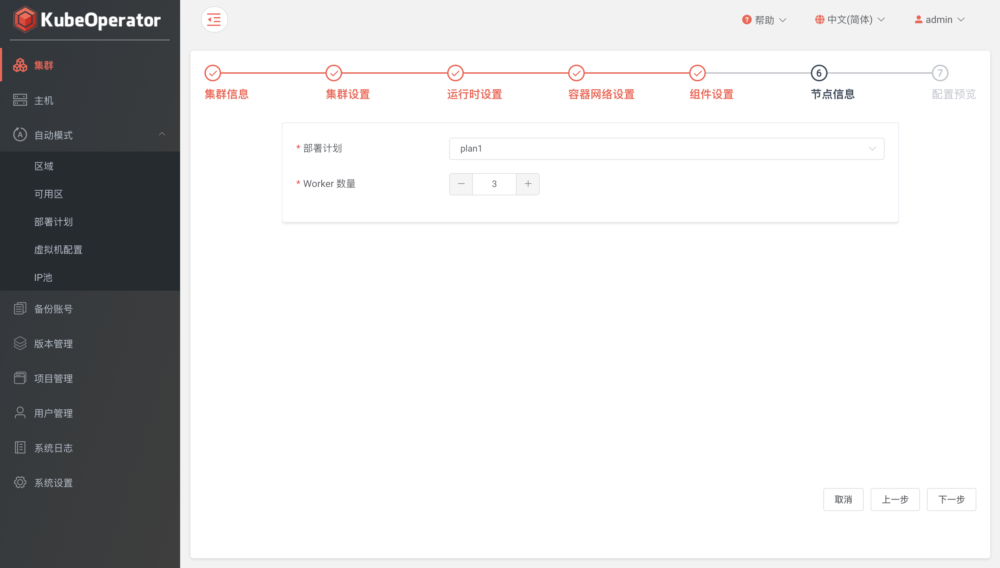
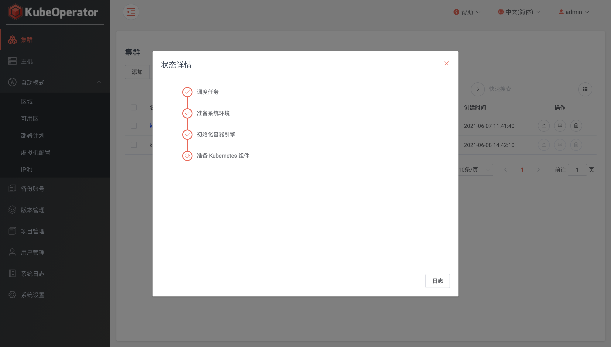

### 集群信息

!!! warning ""
    - 供应商: 支持裸金属（手动模式）和部署计划（自动模式）
    - 版本: 支持版本管理中最新的两个 Kubernetes 版本 
    - 架构: 支持 AMD64 和 ARM64
    - Yum 仓库: 支持替换、共存和不操作三种类型

    !!! info "Yum 仓库"
        * 替换: 会对 K8S 节点服务器原始 yum repo 文件进行备份，之后生成并仅使用 KubeOperator 的 yum repo
        * 共存: 将保持 K8S 节点服务器原始 yum repo 文件不变，同时生成并使用 kubeoperator 的 yum repo
        * 不操作: 将保持使用 K8S 节点服务器原始 yum repo 文件，不对 K8S 节点服务器的 yum repo 做任何操作

### 集群设置

!!! warning ""
    - 最大 POD 数量: 默认 110
    - Pod 子网: 默认 10.244.0.0/18
    - Service 子网: 默认 10.244.64.0/18
    - kube-proxy 模式: 支持 iptables 和 ipvs
    - kubernetes 审计: 支持开启日志审计功能

### 运行时设置

!!! warning ""
    - 容器运行时: 支持 Docker 和 Containerd（注意: ARM64 架构下，容器运行时不支持 Containerd）
    - Docker 数据路径: 默认 /var/lib/docker
    - Container 子网: 默认 172.17.0.1/16

### 容器网络设置

!!! warning ""
    - 网卡名称: 集群节点使用的网卡，根据实际环境填写正确的网卡名称
    - 容器网络: 支持 flannel 和 calico
    - 网络模式: flannel 支持 host-gw 和 vxlan、calico 支持 bgp 和 ipip

    !!! info "vxlan 和 ipip 网络模式"
        * 基于隧道，在任何网络环境下都可以正常工作
        * 优势是对物理网络环境没有特殊要求，只要宿主机IP层可以路由互通即可
        * 劣势是封包和解包耗费CPU性能，且额外的封装导致带宽浪费

    !!! info "host-gw 和 bgp 网络模式"
        * 基于路由，不适用于公有云环境
        * 优势是没有封包和解包过程，完全基于两端宿主机的路由表进行转发
        * 劣势是要求宿主机在2层网络是互通，且路由表膨胀会导致性能降低

### 组件设置

!!! warning ""
    - helm: 支持 v2 和 v3
    - ingress 类型: 支持 nginx-ingress 和 traefik-ingress
    - 安装 GPU 套件: 按需使用，默认选择禁用

### 节点信息

!!! warning ""
    * 根据不同的节点角色选择目标主机（手动模式）

!!! warning ""
    * 选择已授权部署计划，设置 Worker 节点数量（自动模式）

### 确认信息

### 日志

!!! warning ""
    集群创建过程中为 Initializing 状态，点击可查看集群安装进度并支持查看当前任务的实时日志（支持手动暂停任务日志输出）

