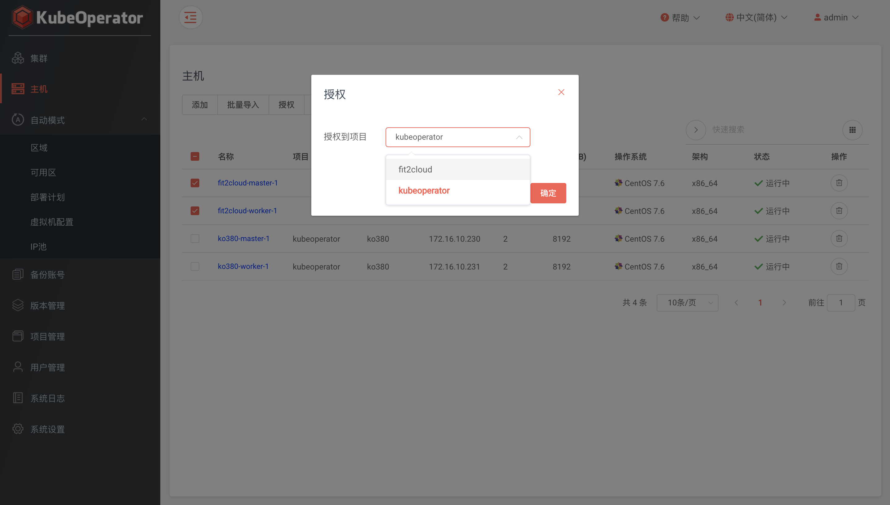

!!! warning ""
    KubeOperator 支持两种 Kubernetes 集群部署方式，一种是手动模式，另外一种是自动模式。手动模式下，用户需要自行准备主机。

    本章节以手动模式部署一个开发测试用集群为例，需要至少准备三台服务器，每台服务器的用途和需求是：

<table>
    <tr>
        <td>角色</td>
        <td>数量</td>
        <td>操作系统</td>
        <td>最低配置</td>
        <td>推荐配置</td>
    </tr>
    <tr>
        <td>部署机</td>
        <td>1</td>
        <td>CentOS 7.6</td>
        <td>4C 8G</td>
        <td>4C 16G</td>
    </tr>
    <tr>
        <td>Master</td>
        <td>1</td>
        <td>CentOS 7.6</td>
        <td>2C 4G</td>
        <td>4C 8G</td>
    </tr>
    <tr>
        <td>Worker</td>
        <td>1</td>
        <td>CentOS 7.6</td>
        <td>2C 4G</td>
        <td>4C 8G</td>
    </tr>
</table>

### 添加主机

!!! warning ""
    * 主机列表可以看到已添加主机的详细信息，包括 IP、CPU、内存、操作系统等。

### 授权

!!! warning ""
    * 系统管理员或项目管理员可将主机授权给目标集群所在项目

