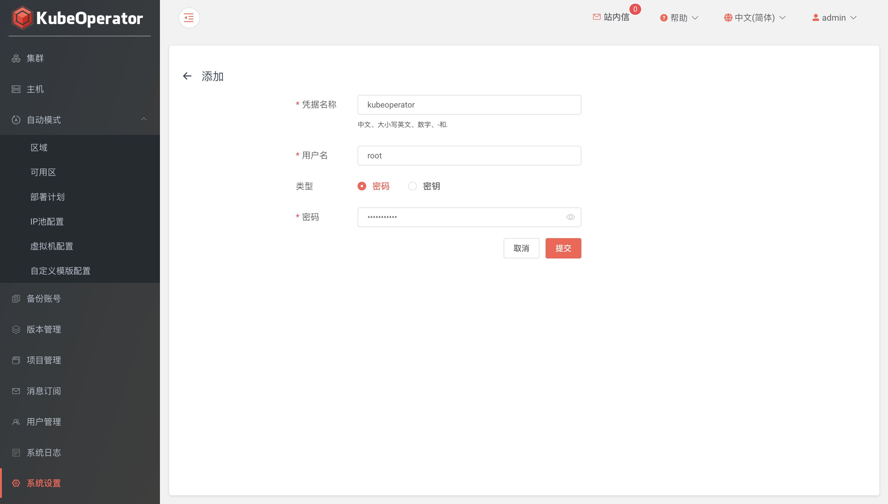

## 系统设置

!!! info ""
    * 仓库协议: 支持 http 和 https，默认 http
    * 仓库 IP: 默认为部署 KubeOperator 的服务器 IP。将使用该 IP 来访问 nexus 仓库
    * CPU架构: 支持 x86_64 和 arm64 ，即两种不同CPU架构的仓库
 
!!! warning "注意"
    如果部署K8S集群时需要K8S节点采用 x86_64 和 arm64 混合部署，则需要添加两个不同CPU架构的仓库

!!! info ""
    * 手动模式创建集群，需要提前设置好主机凭据

!!! info ""
    * NTP Server: 时间同步服务器，默认可以为空。也可以自建或使用公共 NTP Server
    

