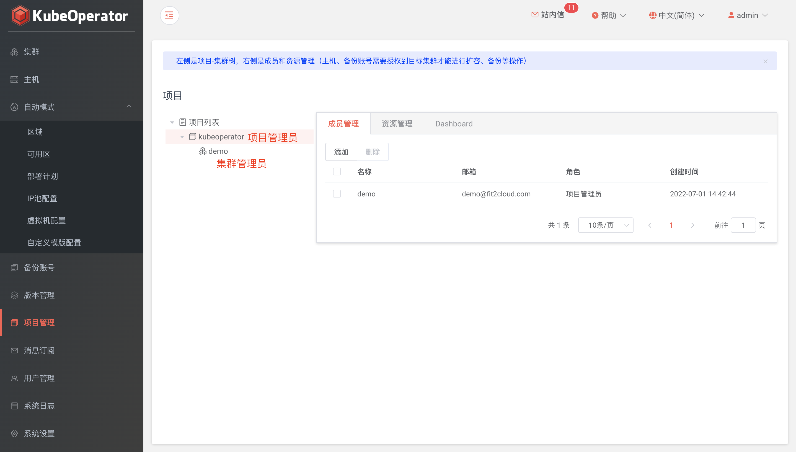
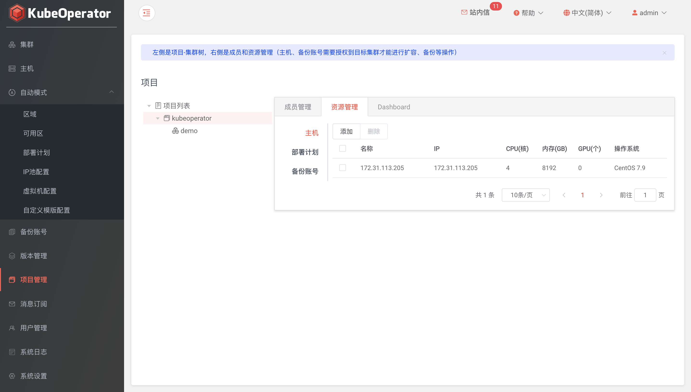
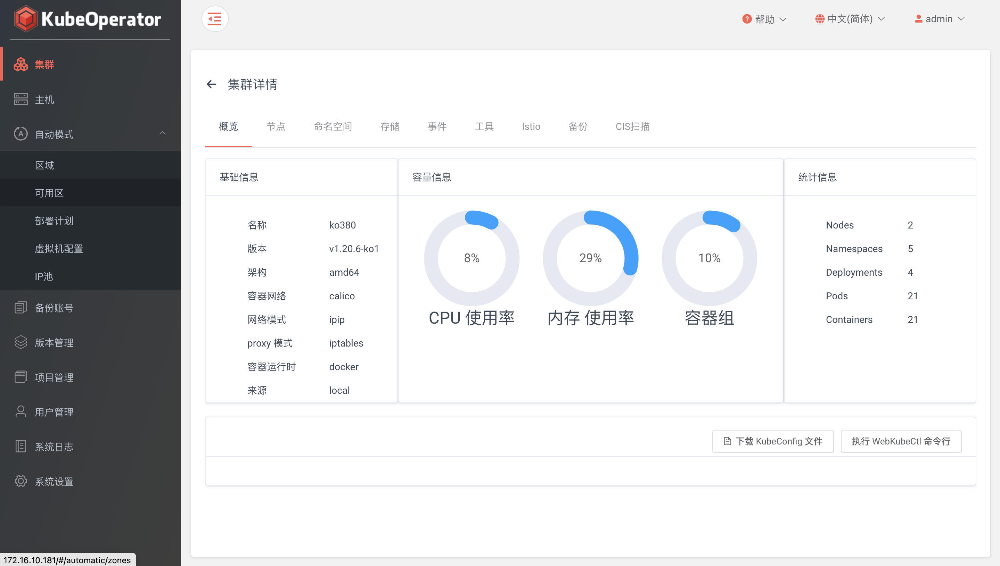
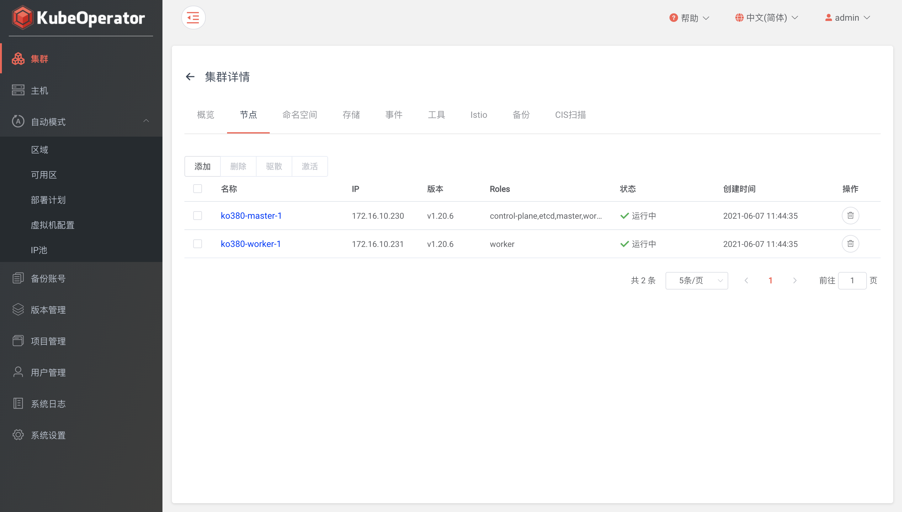
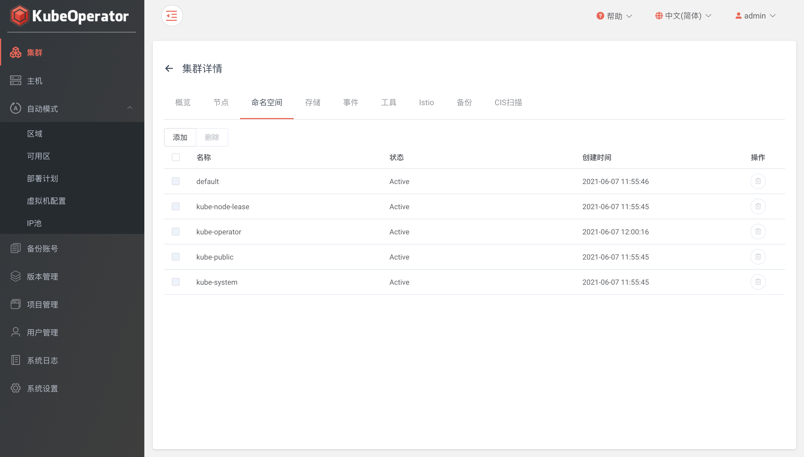

# 在自行准备的主机上规划、部署及运营 Kubernetes 集群

KubeOperator 支持两种 Kubernetes 集群部署方式，一种是手动模式，另外一种是自动模式。手动模式下，用户需要自行准备主机。

本章节以手动模式部署一个开发测试用集群为例，需要准备两台主机，每个主机的用途和需求是：

<table>
    <tr>
        <td>名称</td>
        <td>角色</td>
        <td>数量</td>
        <td>操作系统</td>
        <td>最低配置</td>
        <td>推荐配置</td>
        <td>描述</td>
    </tr>
    <tr>
        <td>master-1</td>
        <td>Master</td>
        <td>1</td>
        <td>CentOS 7.6</td>
        <td>2C 4G</td>
        <td>4C 16G</td>
        <td>运行 etcd、kube-apiserver、kube-scheduler。</td>
    </tr>
    <tr>
        <td>worker-1</td>
        <td>Worker</td>
        <td>1</td>
        <td>CentOS 7.6</td>
        <td>2C 8G</td>
        <td>8C 32G</td>
        <td>运行 kubelet、应用工作负载。</td>
    </tr>   
</table>

## 集群规划（Day 0）

### 系统设置

在使用 KubeOperator 之前，必须先对 KubeOperator 进行必要的参数设置。这些系统参数将影响到 Kubernetes 集群的安装及相关服务的访问。

#### 系统
> 设置系统 IP 和 NTP Server

!!! info "注意"
    * 系统 IP: 部署 KubeOperator 的服务器 IP。将使用该 IP 来访问 KubeOperator
    * NTP Server: 时间同步服务器，默认可以为空。也可以自建或使用公共 NTP Server


#### 凭据
> 凭据为 KubeOperator 连接主机资产的凭证。支持添加 password 和 privatekey 两种方式的凭据


> 注: 系统会初始化名称为 kubeoperator 的凭据作为自动模式所创建服务器的密码


> 注: 密钥方法连接主机举例说明: 在 KubeOperator 主机中首先生成 id_rsa 和 id_rsa.pub 密钥对，将 id_rsa.pub 公钥里面内容添加要连接的目标主机 authorized_keys 文件中，authorized_keys 文件权限需要设置为 600 。然后在 KubeOperator 控制台的【凭据】页面，将开始生成的 id_rsa 私钥文件内容复制到凭据的密钥框中。注意这里的账号需要 root 账号

#### 集群备份
> KubeOperator 目前的备份功能支持三种不同种类的存储，即 AWS S3、aliyun oss 和 Azure 存储


!!! info "AWS S3"
    输入名称、AccessKey、SecretKey、区域和端点，单击【获取桶】来选择桶名称，建议在 S3 新建一个桶单独使用

### 准备主机

我们将准备添加两台主机 一个 master、一个 worker，分别作为 master 节点、worker 节点。

#### 添加主机

主机列表可以看到已添加主机的详细信息，包括 IP、CPU、内存、操作系统等。


> 注: 推荐使用全新的机器。KubeOperator 部署机不能作为 Kubernetes 集群节点使用

### 用户管理
> 支持添加系统管理员用户和普通用户，普通用户可以根据【项目】选择其作为项目管理员，来实现不同用户对不同项目的使用权限的分级管理

#### 系统管理员
> 系统管理员用户权限和系统默认账号 admin 权限完全相同。新建的系统管理员登录系统后可实现所有 admin 权限的操作


#### 普通用户
> 普通用户初始状态没有任何权限。需要在【项目】内添加成为项目管理员


> 注: admin 管理员可以删除、禁用和开启所有用户，新建系统管理员可以删除、禁用和开启除 admin 账号以外的所有用户，普通用户无上述权限

### 项目管理

KubeOperator 系统自带一个默认项目。除默认项目外，系统管理员（admin 账号和新建的系统管理员账号）可以创建其他项目，项目内可以部署多个集群，不同项目之间的集群除系统管理员以外账号是不可见的。项目管理员管理该项目的集群，通过授权资源（包括主机，部署计划和备份账号）给项目，然后可以开始创建集群。

#### 创建项目
> 创建项目完成后需要授权集群所需的资源，然后创建 Kubernetes 集群


#### 添加成员
> 系统管理员账号可以分配一个或多个项目管理员角色给项目，项目管理员可以对该项目创建、安装、升级等管理操作




#### 资源授权
> 在 KubeOperator 环境中的资源需要系统管理员或项目管理员授权给项目后才可以使用，包括主机、备份账号等




> 注: 创建手动模式集群，必须要先将 Kubernetes 节点主机授权到目标项目

## 集群部署（Day 1）

### 集群部署

#### 基本信息
> 输入集群的名称，选择提供商，选择目标 Kubernetes 版本，选择系统架构


!!! info "注意"
    * 集群提供商支持裸金属（手动模式）和部署计划（自动模式）
    * 系统架构支持 AMD64 和 ARM64

#### 配置网络
> 选择容器运行时、容器网络、Pod子网、Service子网、Container子网、最大POD数量、kube-proxy模式、ingress类型、是否开启 Kubernetes 审计等


!!! info "提示"
    容器运行时可以选择 docker 、 containerd，可以修改运行时数据路径
    
    如果集群节点全部都在同一个二层网络下，可以选择选择 flannel + host-gw 或 calico + bgp。如果不是，则选择 flannel + vxlan 或 calico + ipip
    
    选项 POD 子网、Service 子网 和 Container子网 时，要保证不能和已有主机节点 IP 段冲突
    
    kube-proxy 模式可以选择 iptables 、ipvs
    
    ingress 类型可以选择 nginx 、traefik

!!! warning "注意"
    ARM64 架构下，容器运行时不支持 Containerd

#### 节点信息
> 根据不同的节点角色选择目标主机


#### 确认信息
> 集群配置概览页是针对之前步骤所设置参数进行汇总


## 集群运营（Day 2）

### 概览
> 集中显示了集群基本信息、容量信息和统计信息



> 支持 Webkubectl。在集群【概览】页点击 【连接】 按钮，在输入框中就可以执行命令查询集群信息等操作


### 集群伸缩
> 显示集群节点相关信息。支持针对集群 worker 节点的扩缩容



> worker 节点扩容


> worker 节点缩容


### 命名空间
> 集群中现有的 namespace



### 存储
> 设置存储提供商（provisioner）、存储类（storageclass）、持久卷（PersistentVolume）


#### 存储提供商
> 支持的类型有nfs、external-ceph、rook-ceph、vsphere

!!! info "注意"
    rook-ceph: 集群所有节点都必须包含指定的磁盘

    vsphere: 集群服务器必须在指定Folder中，并且服务器名称要和集群node节点名称保持一致

#### 存储类
> 内置 local volume 存储提供商，如需添加其他类型，需要提前创建对应类型的存储提供商

!!! info "注意"
        external-ceph: 需要在 Kubernetes 中创建 admin 及 user 所需的 secret

```
# 可在 ceph 服务端通过以下命令获得 secret key
ceph auth get-key client.admin

# 创建 admin secret
kubectl create secret generic ceph-admin-secret \
--namespace=kube-system \
--type=kubernetes.io/rbd \
--from-literal=key=AQCtabcdKvXBORAA234AREkmsrmLdY67i8vxSQ==
```

#### 持久卷
> 支持添加 hostpath 和 local volume 两种类型的持久卷

### 工具
> 提供 prometheus、chartmuseum、registry、dashboard和kubeapps 五种管理工具，可根据需要自定义安装


> 注: 点击启用按钮，可以设置是否启用存储、设置存储值、选择存储类等参数


### 集群备份
> 可以设置备份账号、状态来实现集群备份功能。选中备份记录，可以实现集群数据恢复功能


### 历史
> 可以查看针对集群的操作记录以及异常时的错误日志

### 监控
> 需要在【工具】页面安装 Prometheus 作为 Grafana 默认数据源


### 集群卸载

> 进入【项目】菜单，选中目标集群，点击【删除】按钮，即集群卸载


