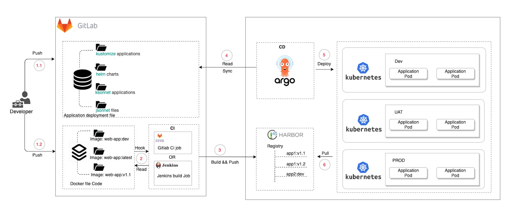
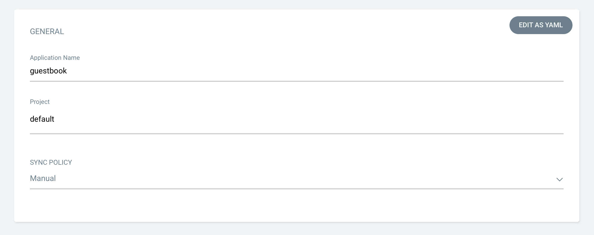
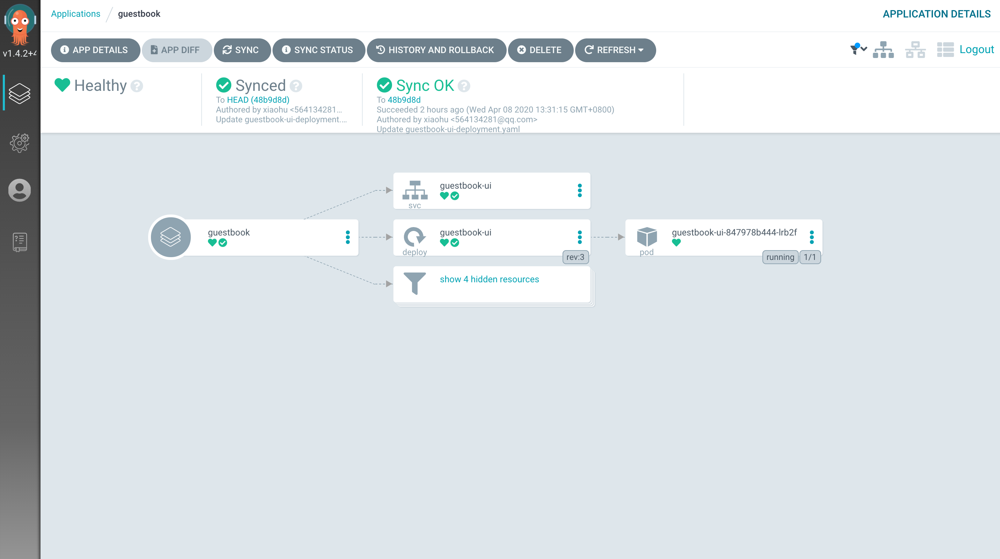

# Argo CD 使用指南

## 什么是 Argo CD ？

!!! warning ""
    Argo CD 是一个为 Kubernetes 而生的，遵循声明式 GitOps 理念的持续部署（CD）工具。Argo CD 可在 Git 存储库更改时自动同步和部署应用程序

!!! warning "优势"
    - 应用定义、配置和环境信息是声明式的，并可以进行版本控制
    - 应用部署和生命周期管理是全自动化的、是可审计的，清晰易懂

    Argo CD 在 CI/CD 流程中的位置如下图所示:



    - 借助 Argo CD 在 Kubernetes 集群上落地 CD

!!! warning "步骤"
    - 将应用的 Git 仓库分为 Application Deployment file 和 Docker file 两个库。Docker file 用于存放应用的核心代码以及 Docker build file，后续将会直接打包成 Docker image；Application Deployment file 可以 Kustomize、Helm、Ksconnet、Jsonnet 等 多种 Kubernetes 包管理工具来定义；以 Helm 为例，Chart 中所使用到的 Image 由 Docker file Code 打包完成后提供
    - 使用 Jenkins 或 Gitlab 等 CI 工具进行自动化构建打包，并将 Docker image push 到 Harbor 镜像仓库
    - 使用 Argo CD 部署应用。Argo CD 可以独立于集群之外，并且支持管理多个 Kubernetes 集群。在 Argo CD 上配置好应用部署的相关信息后 Argo CD 便可以正常工作，Argo CD 会自动和代码仓库 Application deployment file 的内容进行校验，当代码仓库中应用属性等信息发生变化时，Argo CD 会自动同步更新 Kubernetes 集群中的应用；应用启动时，会从 Harbor 镜像仓库拉取 Docker image

## Argo CD 安装指南

!!! warning ""
    - 通过 KubeOperator 应用商店部署 Argo CD 非常简单，我们已经在应用商店直接支持一键部署 Argo CD


### 部署 Argo CD


### 修改默认配置

!!! warning ""
    - 根据需要修改默认配置，再点击提交，或者直接使用默认参数提交


### 等待服务就绪


### 访问 Argo CD

!!! warning ""
    - 我们是通过 NodePort 的方式访问 Argo CD ，获取 Argo CD 的 NodePort 信息，需要在该应用的描述信息中按照提示步骤，可以在 Kubernetes 集群任意 master、worker 节点中执行描述中的命令


## Argo CD 使用指南

### 创建 APP


### 填写信息

!!! warning ""
    - 填写应用名称: guestbook ，项目: default ，同步策略: 手动



### 配置来源

!!! warning ""
    - 这里配置的是 Git ，代码仓库的 URL 配置为 Github 上的项目地址: https://github.com/argoproj/argocd-example-apps.git ，Revision 选择: HEAD ，项目路径选择: guestbook


### 选择集群

!!! warning ""
    - 应用部署的目标集群: https://kubernetes.default.svc ，因为此次的 Argo CD 部署在 Kubernetes 集群当中，默认 Argo CD 已经帮我们添加好当前所在的 Kubernetes 集群，直接使用即可。Namespace 选择: my-app , Namespcae 可以在 Kubernetes 集群上使用  # kubectl create namespace my-app 命令来创建


### 单击创建


### 同步（部署）

!!! warning ""
    - 由于尚未部署应用程序，并且尚未创建 Kubernetes 资源，所以 Status 还是 OutOfSync 状态，因此我们还需要点击 SYNC 进行同步(部署)。同时也可以安装 Argo CD 客户端，使用 Argo CD CLI 进行同步

    ``` sh
    argocd app sync guestbook
    ```


!!! warning ""
    - 等待应用创建完成




!!! warning ""
    - 完成后在 Kubernetes 集群中查看应用


!!! warning ""
    - 想要了解 Argo CD 更多的详细内容，可以前往 Argo CD 官方文档查看 https://argoproj.github.io/argo-cd
