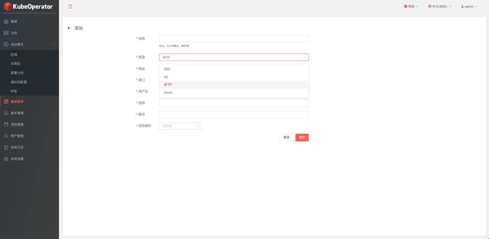
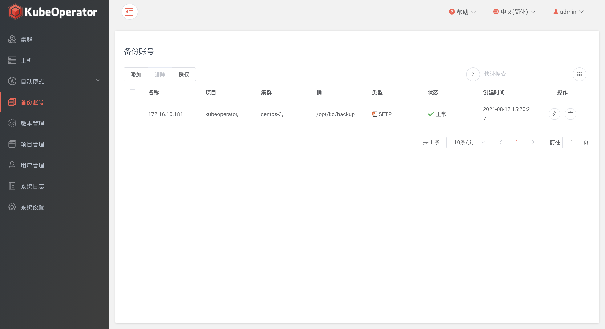

!!! warning ""
    * 目前的备份账号功能支持四种不同种类的存储，即 AWS S3、aliyun oss、Azure 和 SFTP

### 添加

### 列表

### 授权

!!! warning ""
    * 点击授权按钮后，授权操作会统一在项目管理菜单中实现
    * 系统管理员和项目管理员可以将备份账号授权到项目或集群，同时支持在项目和集群中取消已授权的备份账号