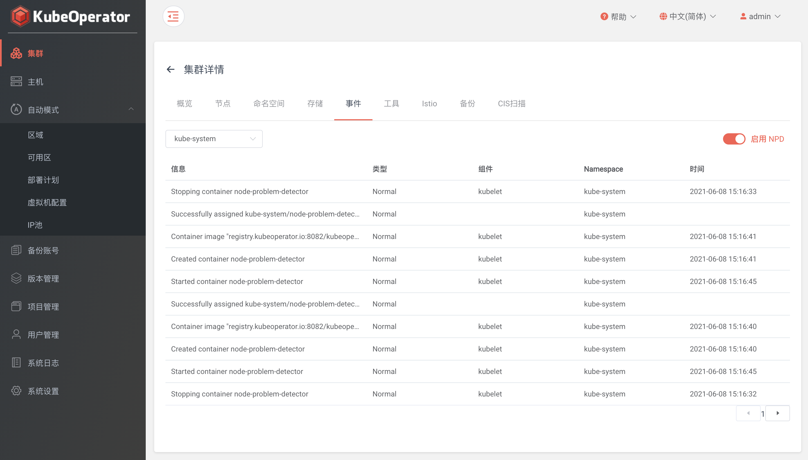
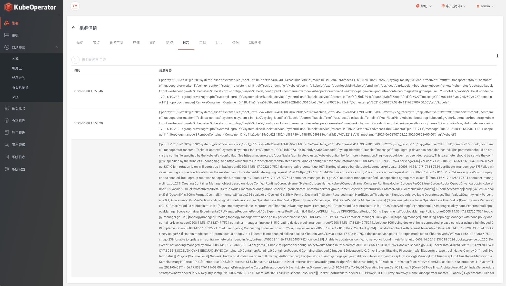
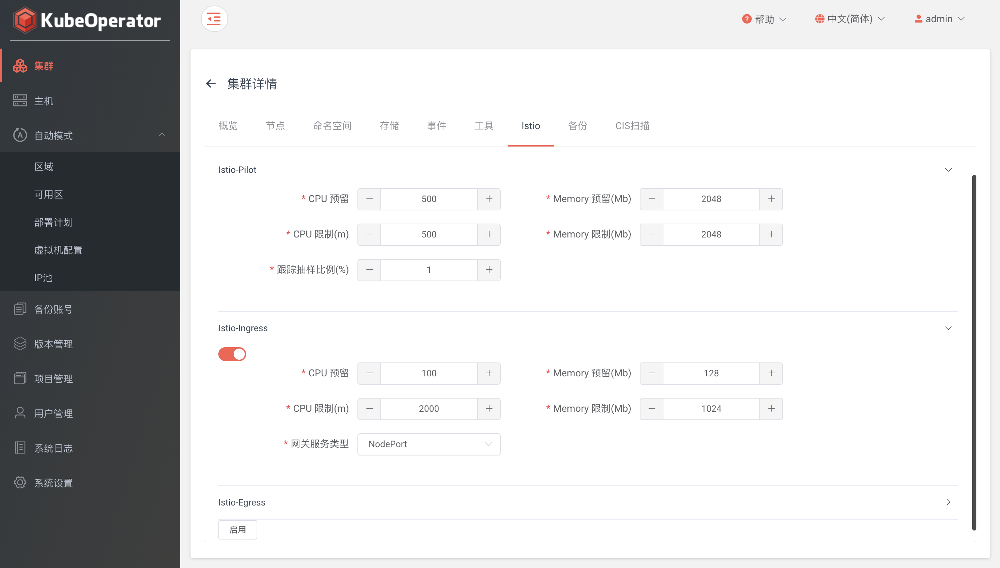
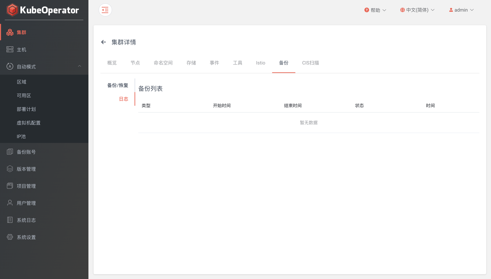
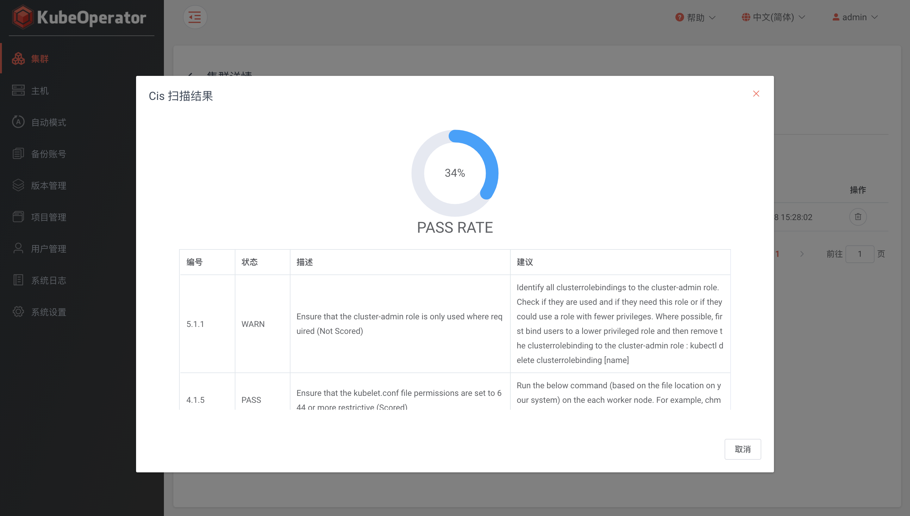
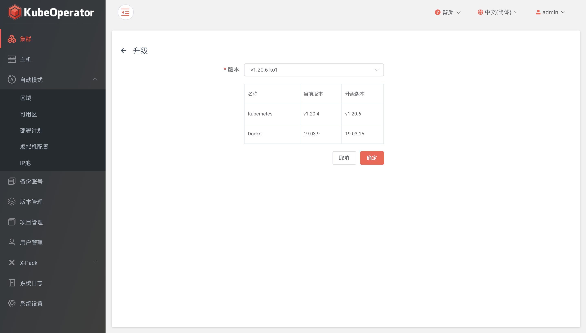
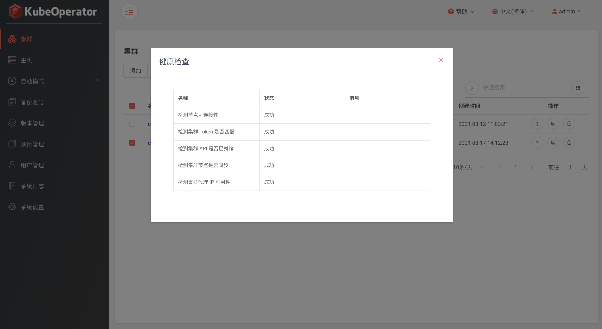

### 概览

!!! warning ""
    - 集中显示了集群基本信息、容量信息和统计信息
    - 可下载 kubeconfig 文件（将 kubeconfig 文件中 cluster.server 地址修改为 master 节点 IP）


!!! warning ""
    支持在 web 页面执行 kubectl 命令查询集群信息等操作


### 节点

!!! warning ""
    集中显示了集群所有节点的基础信息


!!! warning ""
    点击节点，可查看节点标签、运行状态等具体信息


!!! warning "驱散"
    - 驱散成功后，节点将处于不可调度状态
    - 安全模式: 如果节点拥有独立的 Pod 或临时的数据，它将被隔离但不会被驱散
    - 强制模式: 独立 Pods 和它们的数据将永久删除


!!! warning "激活"
    撤销已驱散节点的不可调度状态

### 命名空间

!!! warning ""
    - 列表显示为集群中现有的 namespace，支持创建和删除操作
    - 系统默认和 kube-operator namespace 不支持删除


### 存储

!!! warning ""
    设置存储提供商（provisioner）、存储类（storageclass）、持久卷（PersistentVolume）


#### 存储提供商

!!! warning ""
    支持的类型有 nfs、external-ceph、rook-ceph、vsphere 和 oceanstor（华为 csi）

!!! warning ""
    - nfs: 需要指定 nfs 服务端版本、IP 和共享目录
    - external-ceph: 创建成功之后，会在集群中初始化 ceph provisioner 相关 pod
    - rook-ceph: 需要指定 ceph 集群所需磁盘（集群所有节点都必须包含指定的磁盘，如sdb,sdc...）
    - vsphere: 集群服务器必须在指定 Folder 中（自动模式创建集群默认 Folder 为 kubeoperator），并且服务器名称要和集群 node 节点名称保持一致
    - oceanstor: 参考文档: https://github.com/Huawei/eSDK_K8S_Plugin/tree/master/docs/zh

#### 存储类

!!! warning ""
    内置 local volume 存储提供商，如需添加其他类型，需要提前创建对应类型的存储提供商

!!! warning "external-ceph: 需要在 Kubernetes 中创建 admin 及 user 所需的 secret"

    ```
    # 可在 ceph 服务端通过以下命令获得 secret key
    ceph auth get-key client.admin

    # 创建 admin secret
    kubectl create secret generic ceph-admin-secret \
    --namespace=kube-system \
    --type=kubernetes.io/rbd \
    --from-literal=key=AQCtabcdKvXBORAA234AREkmsrmLdY67i8vxSQ==
    ```

#### 持久卷

!!! warning ""
    支持添加 hostpath 和 local volume 两种类型的持久卷，需要提前目标主机创建文件目录

### 事件

!!! warning ""
    - 支持查看目标 namespace 下的系统事件
    - 支持启用 node-problem-detector



### 日志

!!! warning ""
    需要在【工具】页面开启 ElasticSearch 或 Loki 日志组件（不支持同时开启）



### 监控

!!! warning ""
    需要在【工具】页面开启 Prometheus 作为 Grafana 默认数据源


### 工具

!!! warning ""
    提供 prometheus、kubeapps、grafana、elasticsearch、loki、dashboard、registry和chartmuseum 八种管理工具，可根据需要自定义安装

    !!! warning ""
        - 点击启用按钮，可以设置 namespace 和是否启用存储等参数
        - 失败状态下，可点击启用按钮重新设置参数提交（会触发更新操作）


### istio

!!! warning ""
    默认安装版本为 1.8.0，ingress 和 egress 可根据需要手动开启



### 备份恢复

!!! warning ""
    - 集群备份: 支持立即备份、定时备份（需要在系统设置中设置备份账号，并授权到目标项目）
    - 集群恢复: 支持备份列表文件恢复和本地备份文件恢复（上传 etcd 快照文件）


!!! warning "日志"
    可以查看针对集群的备份、恢复记录以及任务执行异常时的错误日志



### CIS 扫描

!!! warning ""
    通过 CIS 安全扫描功能，可以帮助集群管理员检查Kubernetes集群是否已经安全部署



### 集群升级

!!! warning ""
    - 进入【项目】菜单，选中目标集群，点击【升级】按钮，选择要升级到的目标版本
    - 升级之前，会先检测当前 kubernetes 集群中 etcd、docker/containerd 和 kubernetes 版本，若检测结果为可升级，将会对 etcd、docker/containerd、kubernetes 进行统一升级，从而保证集群各组件之间的兼容性
    - 升级过程中，支持查看任务实时的日志输出



### 集群扩容、缩容

!!! warning "worker 节点扩容"
    - 手动模式需要选择要添加的主机（主机需要在项目管理中授权到目标集群，并且主机状态为运行中）
    - 自动模式输入要扩容 worker 节点的数量


!!! warning "worker 节点缩容"
    - 自动模式: 将所选节点在集群中删除，然后删除所选节点虚拟机
    - 手动模式: 将所选节点在集群中删除，然后在所选节点执行卸载脚本(删除节点上安装的 k8s 集群所依赖的服务)
    - 强制删除: 将忽略脚本执行过程中的错误信息，强制删除数据


!!! warning "注意"
    手动模式节点删除成功后，要手动重启该节点来删除虚拟网卡等信息

### 集群诊断、修复

!!! warning "诊断"
    - 检测节点可连接性
    - 检测集群 Token 是否匹配
    - 检测集群 API 是否已就绪
    - 检测集群节点是否同步
    - 检测集群代理 IP 是否匹配



!!! warning "修复"
    存在异常状态的情况下，可点击修复按钮来修复相关问题

### 集群卸载

!!! warning ""
    - 自动模式: 删除 KubeOperator 创建的虚拟机
    - 手动模式: 在集群所有节点执行卸载任务，删除安装 k8s 集群所依赖的服务（集群卸载完成后，要手动重启节点来删除虚拟网卡等信息）
    - 强制删除: 如果 k8s 集群存在失联状态的节点，可勾选强制删除来删除集群

