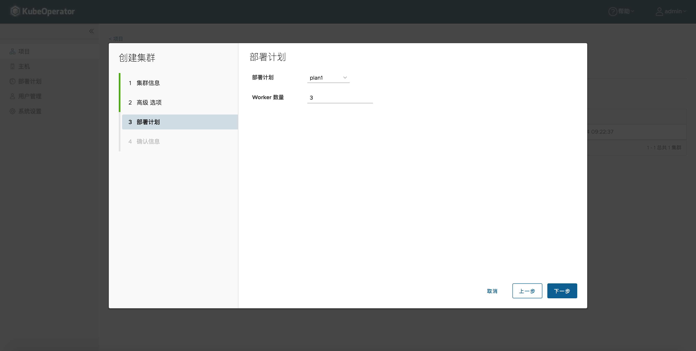

## 集群部署

### 创建集群

#### 基本信息
> 输入集群的名称，选择提供商，选择目标 Kubernetes 版本，选择系统架构。

!!! info "注意"
    * 集群提供商支持裸金属（手动模式）和部署计划（自动模式）
    * 系统架构支持 AMD64 和 ARM64

#### 配置网络
> 选择容器运行时、容器网络、Pod子网、Service子网、Container子网、最大POD数量、kube-proxy模式、ingress类型、是否开启 Kubernetes 审计等。

!!! info "提示"
    容器运行时可以选择 docker 、 containerd，可以修改运行时数据路径。
    
    如果集群节点全部都在同一个二层网络下，可以选择选择 flannel + host-gw 或 calico + bgp。如果不是，则选择 flannel + vxlan 或 calico + ipip。
    
    选项 POD 子网、Service 子网 和 Container子网 时，要保证不能和已有主机节点 IP 段冲突。
    
    kube-proxy 模式可以选择 iptables 、ipvs。
    
    ingress 类型可以选择 nginx 、traefik。

!!! warning "注意"
    ARM64 架构下，容器运行时不支持 Containerd

#### 节点信息（手动）
> 根据不同的节点角色选择目标主机

#### 部署计划（自动）
> 选择已授权部署计划，设置 Worker 节点数量

#### 确认信息
> 集群配置概览页是针对之前步骤所设置参数进行汇总。

### 删除集群
> 点击【删除】按钮，可以删除目标集群（卸载）。

