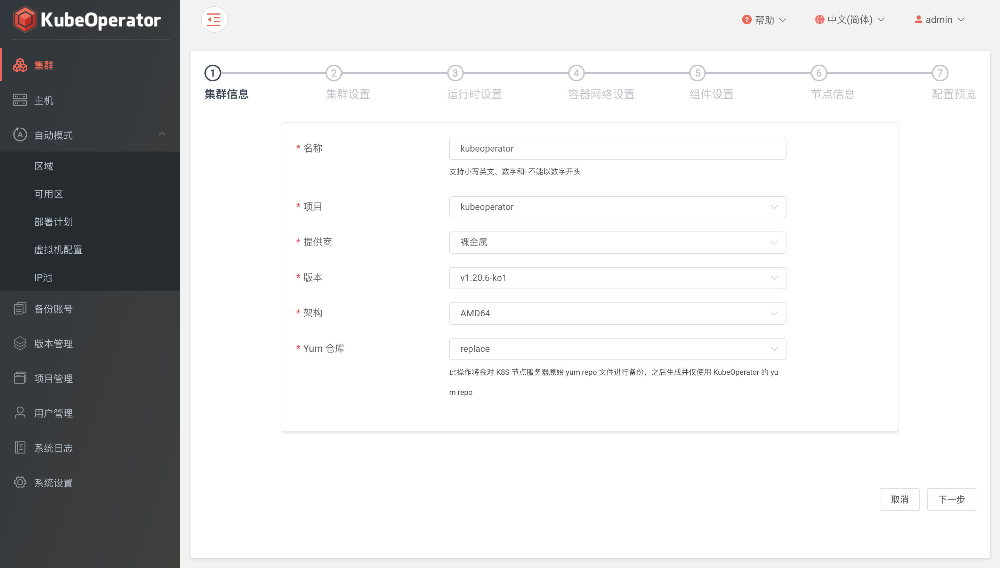

## 集群部署

### 创建集群

#### 基本信息

点击【项目】菜单进入目标项目，点击【集群】TAB页的【添加】按钮进行集群的创建。
在【集群信息】里输入集群的名称，选择提供商，选择该集群所要部署的 Kubernetes 版本，选择系统架构。

> 集群提供商支持裸金属和部署计划。系统架构支持AMD64和ARM64。

#### 配置网络

【高级选项】环节，选择容器运行时、容器网络、Pod子网、Service子网、Container子网、最大POD数量、kube-proxy模式、ingress类型、是否开启 Kubernetes 审计等。

!!! info "提示"
    容器运行时可以选择 docker 、 containerd，可以修改运行时数据路径。
    
    如果集群节点全部都在同一个二层网络下，可以选择选择 flannel + host-gw 或 calico + bgp。如果不是，则选择 flannel + vxlan 或 calico + ipip。
    
    选项 POD 子网、Service 子网 和 Container子网 时，要保证不能和已有主机节点 IP 段冲突。
    
    kube-proxy 模式可以选择 iptables 、ipvs。
    
    ingress 类型可以选择 nginx 、traefik。

> arm64 架构下，容器运行时不支持 containerd。

#### 节点信息

【选择节点】环节，可以根据不同的节点角色，在主机下拉列表中可列出该项目中所有被授权的主机。

#### 确认信息

所有步骤完成后，会有一个集群配置概览页对之前步骤所设参数进行汇总，用户可在此页进行集群配置的最后检查。

### 删除集群

点击【项目】菜单进入目标项目，点击【集群】TAB页的【删除】按钮进行集群的删除（卸载）。

