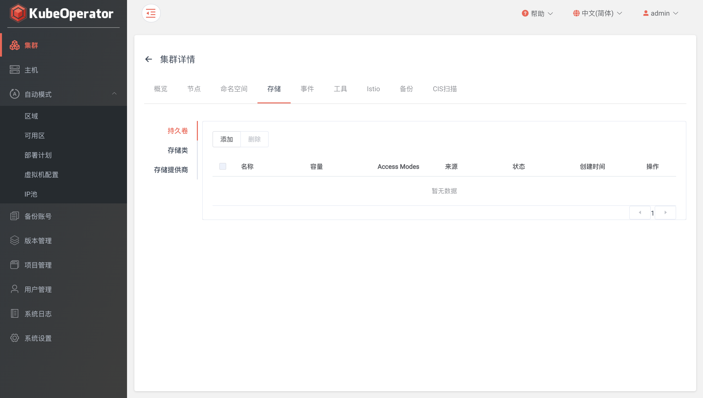
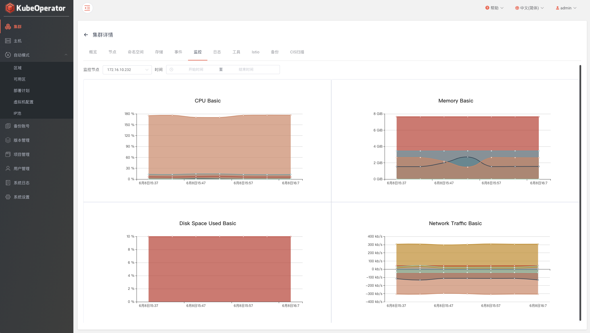
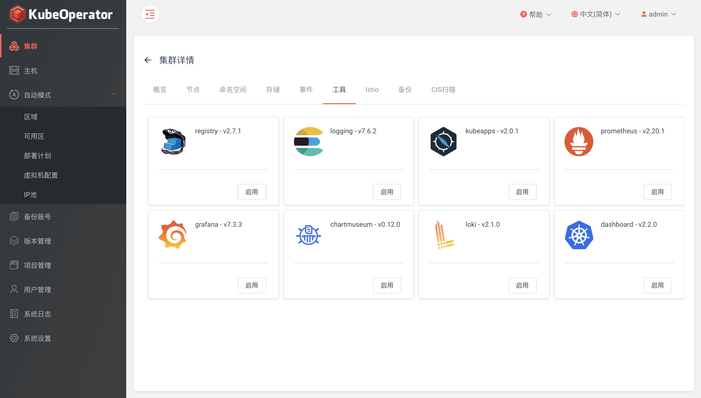
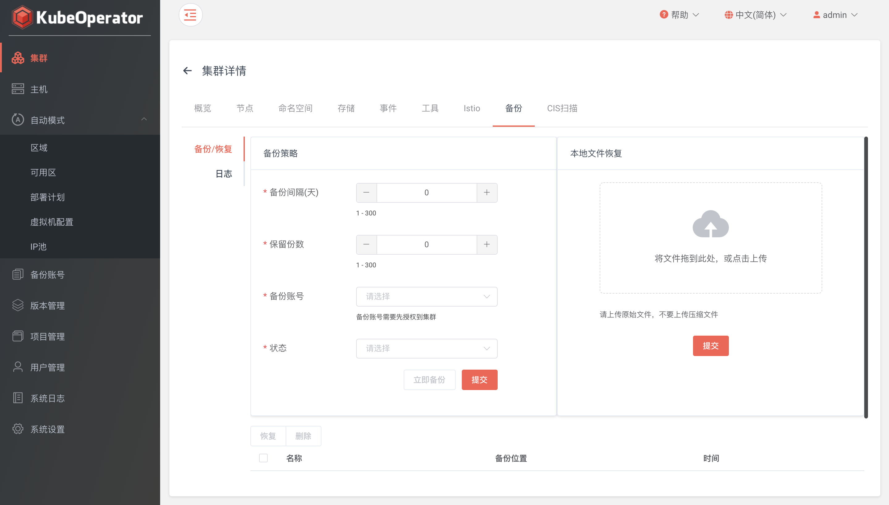
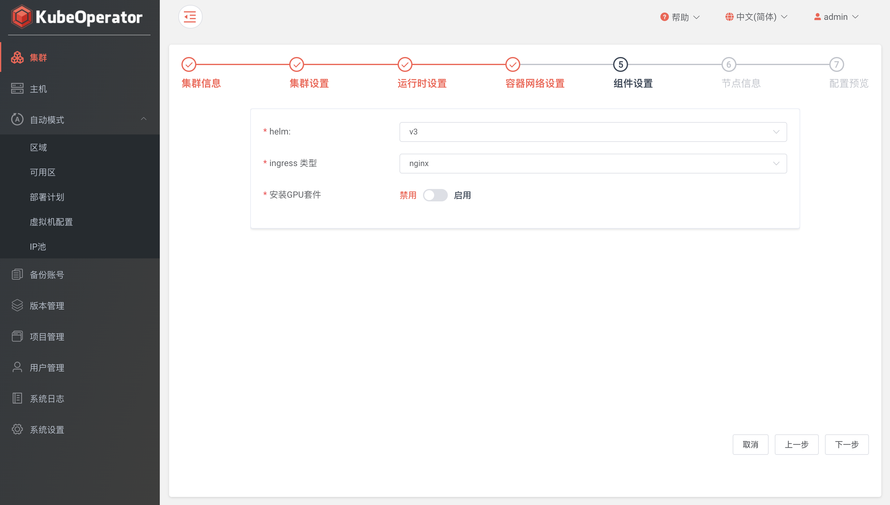

### 概览

!!! warning ""
    集中显示了集群基本信息、容量信息和统计信息


!!! warning ""
    支持 Webkubectl。在集群【概览】页点击 【连接】 按钮，在输入框中就可以执行命令查询集群信息等操作


!!! warning ""
    在升级之前，会先检测当前 kubernetes 集群中 etcd、docker/containerd 和 kubernetes 版本。若检测结果为可升级，将会对 etcd、docker/containerd、kubernetes 进行统一升级，从而保证集群各组件之间的兼容性。

### 集群伸缩

!!! warning ""
    显示集群节点相关信息。支持针对集群 worker 节点的扩缩容


!!! warning ""
    worker 节点扩容（手动模式选择要添加的主机，自动模式输入扩容后 worker 节点数量）


!!! warning ""
    worker 节点缩容


### 命名空间

!!! warning ""
    集群中现有的 namespace


### 存储

!!! warning ""
    设置存储提供商（provisioner）、存储类（storageclass）、持久卷（PersistentVolume）



#### 存储提供商

!!! warning ""
    支持的类型有nfs、external-ceph、rook-ceph、vsphere

!!! info ""
    * rook-ceph: 集群所有节点都必须包含指定的磁盘
    * vsphere: 集群服务器必须在指定Folder中，并且服务器名称要和集群node节点名称保持一致

#### 存储类

!!! warning ""
    内置 local volume 存储提供商，如需添加其他类型，需要提前创建对应类型的存储提供商

!!! info "external-ceph: 需要在 Kubernetes 中创建 admin 及 user 所需的 secret"

    ```
    # 可在 ceph 服务端通过以下命令获得 secret key
    ceph auth get-key client.admin

    # 创建 admin secret
    kubectl create secret generic ceph-admin-secret \
    --namespace=kube-system \
    --type=kubernetes.io/rbd \
    --from-literal=key=AQCtabcdKvXBORAA234AREkmsrmLdY67i8vxSQ==
    ```

#### 持久卷

!!! warning ""
    支持添加 hostpath 和 local volume 两种类型的持久卷

### 事件

!!! warning ""
    支持查看目标 namespace 下的系统事件


### 监控

!!! warning ""
    需要在【工具】页面安装 Prometheus 作为 Grafana 默认数据源



### 工具

!!! warning ""
    提供 prometheus、chartmuseum、registry、dashboard和kubeapps 五种管理工具，可根据需要自定义安装



!!! warning ""
    点击启用按钮，可以设置是否启用存储、设置存储值、选择存储类等参数


### 备份恢复

!!! warning ""
    - 集群备份: 支持立即备份、定时备份
    - 集群恢复: 支持本地备份文件恢复（上传 etcd 快照文件）



### CIS 扫描

!!! warning ""
    通过 CIS 安全扫描功能，可以帮助集群管理员检查Kubernetes集群是否已经安全部署


### 历史

!!! warning ""
    可以查看针对集群的操作记录以及异常时的错误日志


### 集群升级

!!! warning ""
    进入【项目】菜单，选中目标集群，点击【升级】按钮，选择要升级到的目标版本


### 集群卸载

!!! warning ""
    进入【项目】菜单，选中目标集群，点击【删除】按钮

