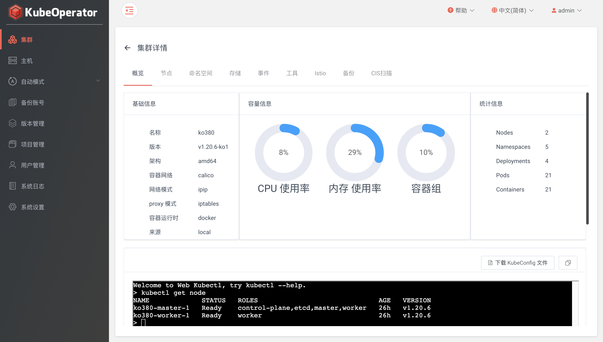
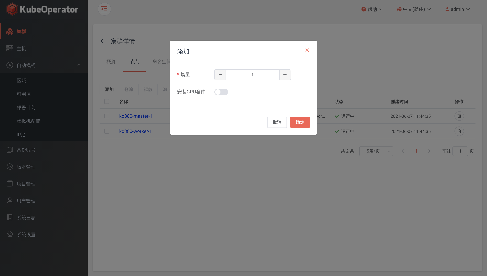

## 集群运营

### 概览

【概览】页面，集中显示了集群基本信息、容量信息和统计信息。

KubeOperator 支持 Webkubectl。在集群【概览】页单击 连接 按钮，在输入框中就可以执行命令查询集群信息等操作。

### 节点

【节点】页面，显示了集群节点相关信息。并支持扩缩容 K8s 集群 worker 节点数量。

> 集群worker节点扩容

> 集群worker节点缩容

### 命名空间

【命名空间】页面，显示了集群中现有的namespace。

### 存储

【存储】页面，可以设置存储提供商（provisioner）、存储类（storageclass）、持久卷（PersistentVolume）。

#### 存储提供商

支持的类型有nfs、external-ceph、rook-ceph、vsphere。

> rook-ceph：集群所有节点都必须包含指定的磁盘。
> vsphere：集群服务器必须在指定Folder中，并且服务器名称要和集群node节点名称保持一致。

### 工具

【工具】页面，提供了 prometheus、chartmuseum、registry、dashboard和kubeapps 五种管理工具，可根据需要自定义安装。

点击启用按钮，可以设置参数，如：是否启用存储、设置存储值、选择存储类等。

### 备份

【备份】页面，可以设置备份账号、状态来实现集群备份功能。选中备份记录，可以实现集群数据恢复功能。

### 历史