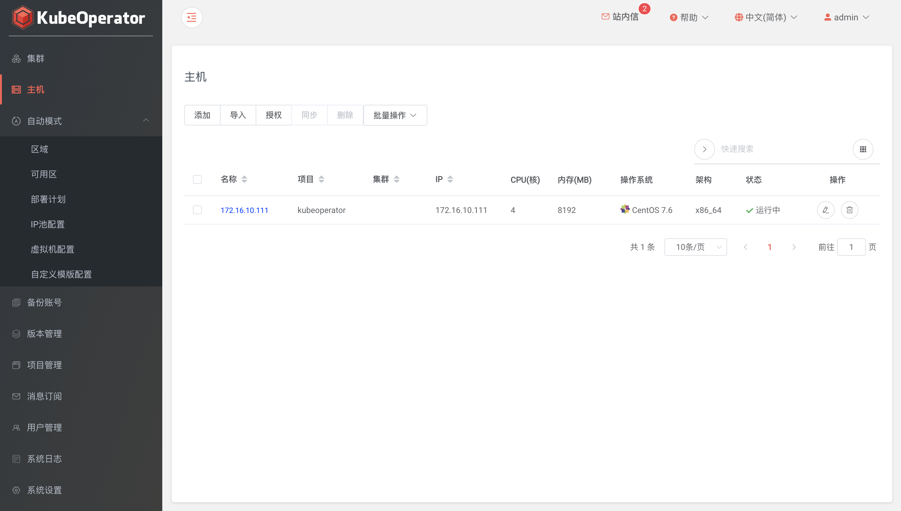
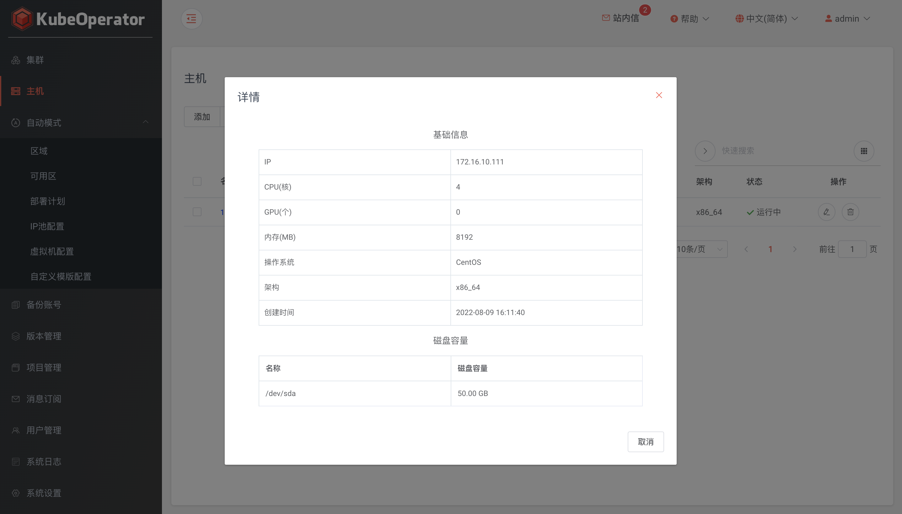
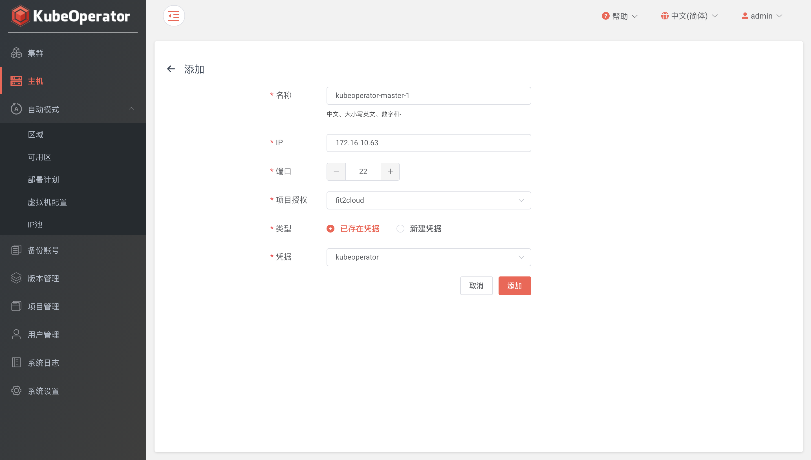
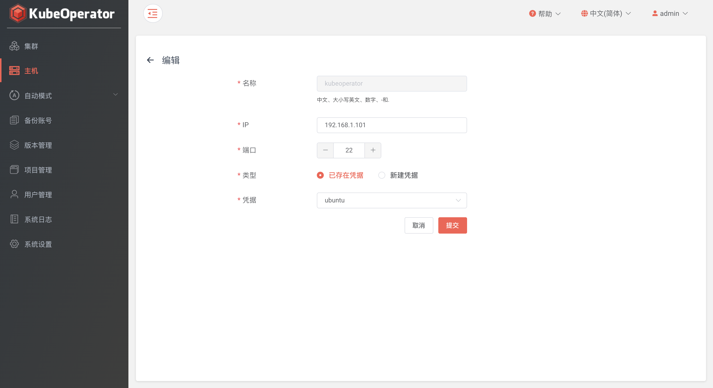
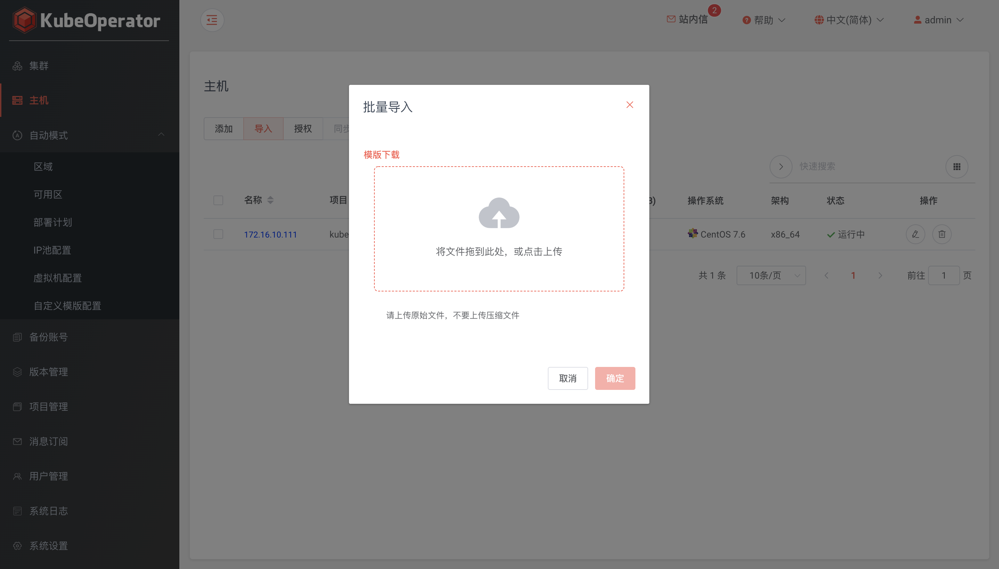
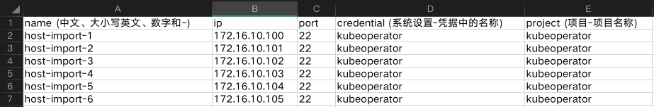

!!! warning ""
    手动模式创建集群，需要先添加目标节点主机

### 列表

!!! warning ""
    * 主机列表可以查看已添加主机的详细信息，包括 IP、CPU、内存、操作系统等
    * 点击主机，查看主机基础信息和磁盘信息

### 添加

!!! warning ""
    * 集群节点推荐使用全新的服务器
    * KubeOperator 部署机不能作为 Kubernetes 集群节点使用

### 编辑

!!! warning ""
    支持编辑非绑定状态的主机

### 批量导入

!!! warning ""
    * 点击批量导入按钮，点击下载模版链接下载excel模版并添加主机信息

### 授权

!!! warning ""
    * 点击授权按钮后，授权操作会统一在项目管理菜单中实现
    * 系统管理员和项目管理员可以将主机授权到项目或集群，同时支持在项目和集群中取消已授权的主机

### 同步 

!!! warning ""
    如果主机状态异常或主机配置有手动更新，可以点击同步按钮来实现主机状态和配置的一致

