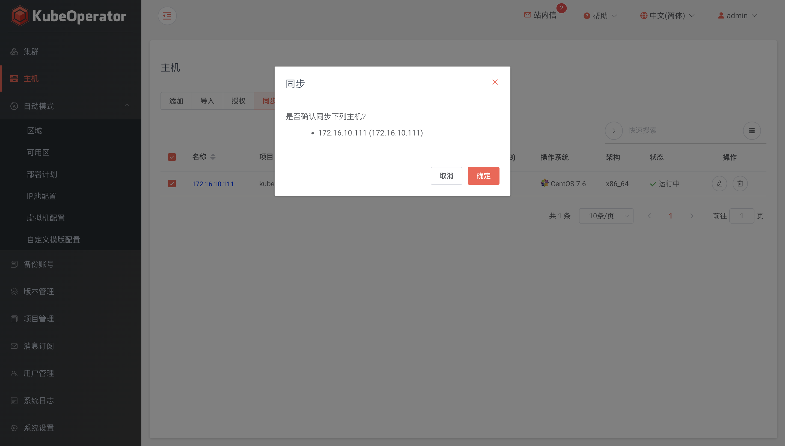

!!! warning ""
    手动模式创建集群，需要先添加目标节点主机

### 列表

!!! warning ""
    * 主机列表可以看到已添加主机的详细信息，包括 IP、CPU、内存、操作系统等

### 添加

!!! warning ""
    * 推荐使用全新的机器
    * KubeOperator 部署机不能作为 Kubernetes 集群节点使用

### 批量导入

!!! warning ""
    * 点击批量导入按钮，点击下载模版链接下载excel模版并添加主机信息

### 授权

!!! warning ""
    * 系统管理员或项目管理员可将主机授权给目标集群所在项目

### 刷新

!!! warning ""
    * 同步主机基本信息和磁盘信息