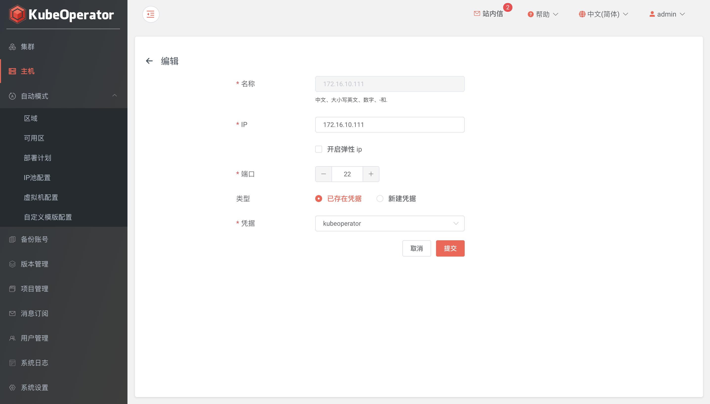

!!! warning ""
    手动模式创建集群，用户需要自行准备主机

### 列表

!!! warning ""
    - 主机列表可以查看已添加主机的详细信息，包括 IP、CPU、内存、操作系统等
    - 点击主机，查看主机基础信息和磁盘信息

### 添加

!!! warning ""
    - 集群节点推荐使用全新的服务器
    - KubeOperator 部署机不能作为 Kubernetes 集群节点使用

### 编辑

!!! warning ""
    支持编辑非绑定状态的主机

### 导入

!!! warning ""
    点击批量导入按钮，点击下载模版链接下载excel模版并添加主机信息

### 授权

!!! warning ""
    授权操作需要在项目管理菜单中实现（资源管理 - 备份账号），可以将主机授权到项目或集群

### 同步 

!!! warning ""
    如果主机状态异常或主机配置有手动更新，可以点击同步按钮来实现主机状态和配置的一致

### 批量操作

!!! warning ""
    支持批量修改主机凭据和端口
