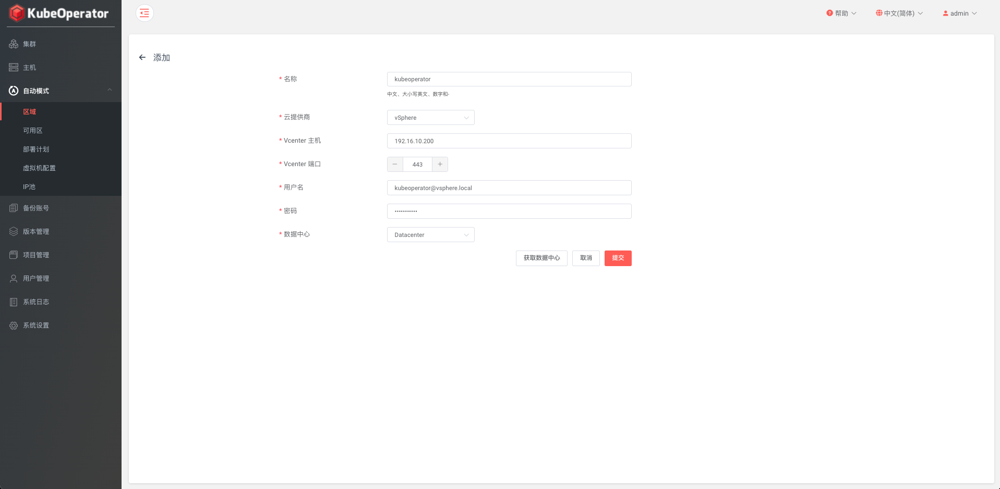
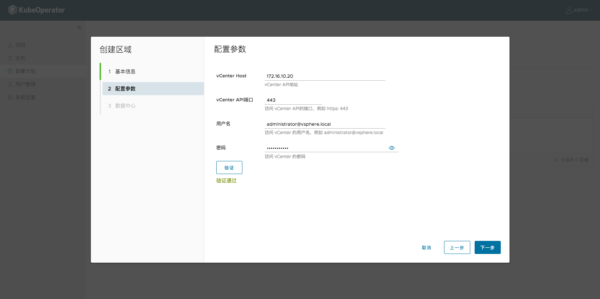
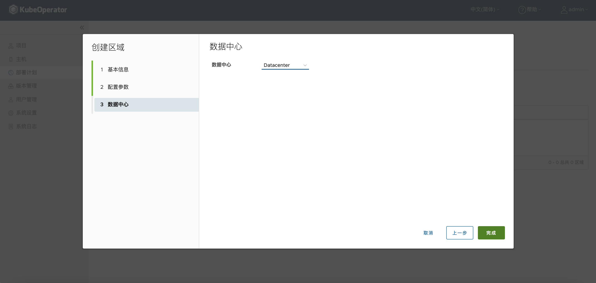
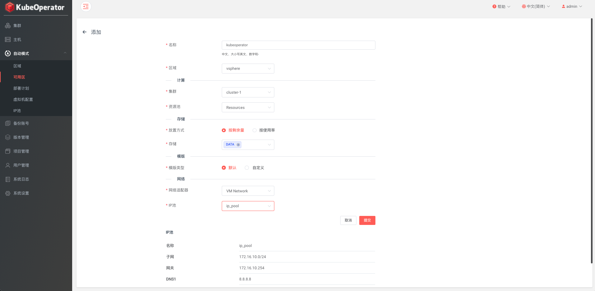
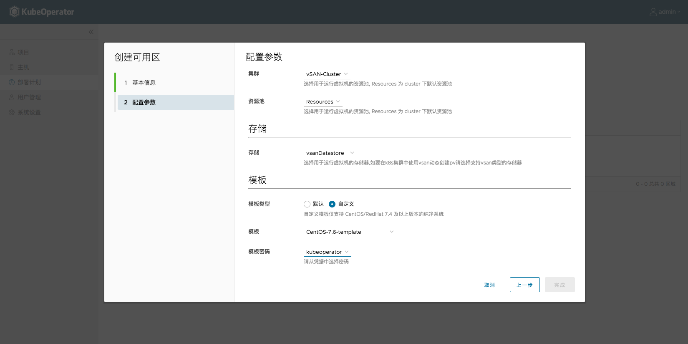
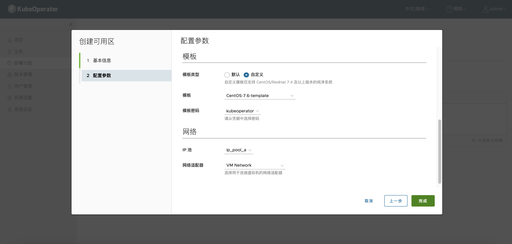
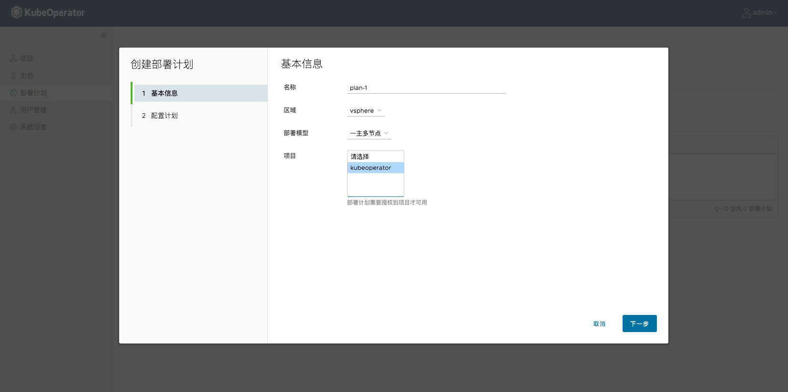
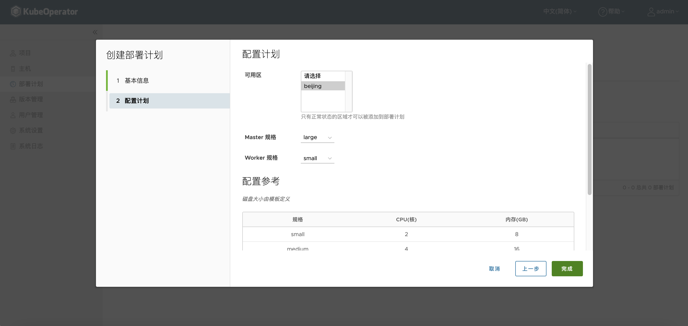

## 创建部署计划

### 创建区域(Region)

Region：与 公有云中的 Region 概念相似，可以简单理解为地理上的区域。在 vSphere 体系中我们使用 DataCenter 实现 Region 的划分。创建区域时，首先选择提供商，目前仅支持 VMware vSphere 和 Openstack。

配置参数时，需要提供 vSphere 环境信息，包括 vCenter IP，用户名和密码，单击【验证】可以校验 vSphere 信息是否正确。

> 注：vCenter 的用户需要的权限比较高，建议直接绑定带有管理员角色的用户。

最后一步选择 vCenter 的一个数据中心。

### 创建可用区(Zone)

Zone: 与 公有云中的 AZ 概念相似，可以简单理解为 Region 中具体的机房。在 vSphere 体系中我们使用不同的 Cluster 或者同个 Cluster 下的不同 Resource Pool 来实现 Zone 的划分。创建可用区时需要选择一个之前添加的区域，如下图：

选择可用区配置参数时，需要选择计算集群，资源池，存储类型以及网络适配器等信息，这些信息依赖于 vCenter 环境配置。目前版本支持用户自定义模版，支持的操作系统包括 CentOS 7.4/7.5/7.6/7.7 和 Redhat 7.4/7.5/7.6/7.7 。

最后单击【检测】按钮，校验输入的起始 IP 地址和子网掩码等信息格式是否正确，检测通过之后才可以单击【完成】。

添加成功后会有一个初始化的过程，状态变为就绪后可以选择该可用区创建部署计划。

### 创建部署计划(Plan)

Plan: 在 KubeOperator 中用来描述在哪个区域下，哪些可用区中，使用什么样的机器规格，部署什么类型的集群的一个抽象概念。
这里以一主多节点类型举例。

部署计划配置包括选择可用区（可用区可以单选或多选），并设置 Master 节点，Worker 节点的规格，即 CPU，内存和磁盘。

> 注：多主多节点集群可以选择多个可用区的部署计划，此时集群创建时不支持使用 vSAN 存储。