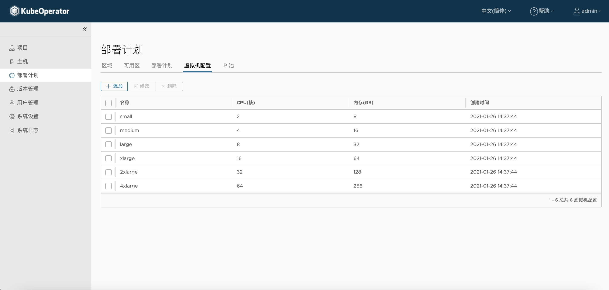
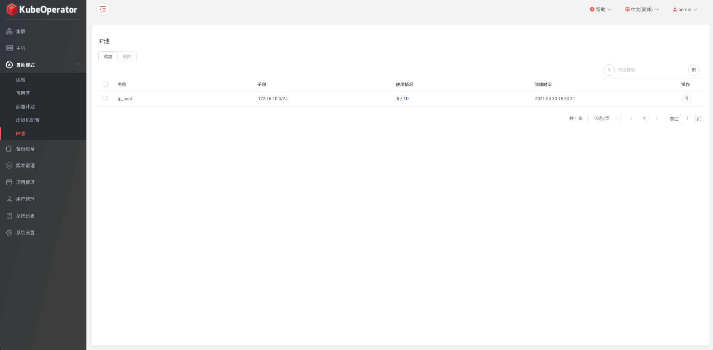
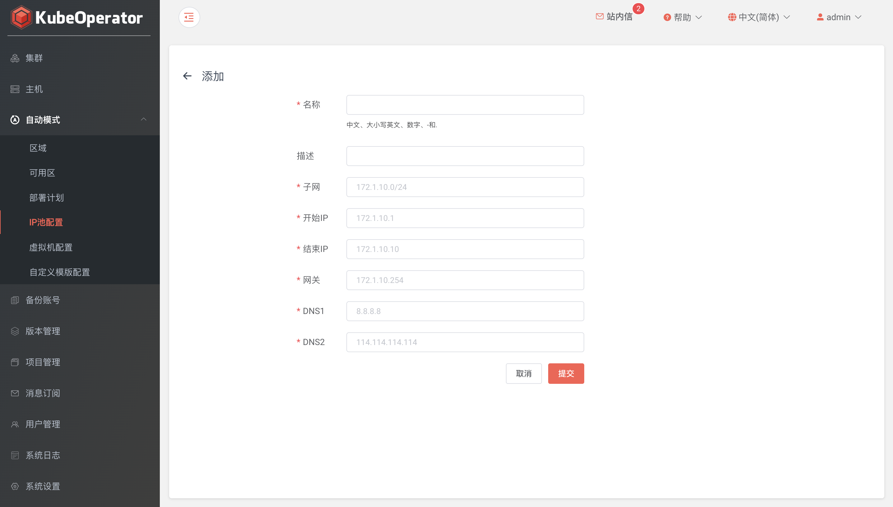
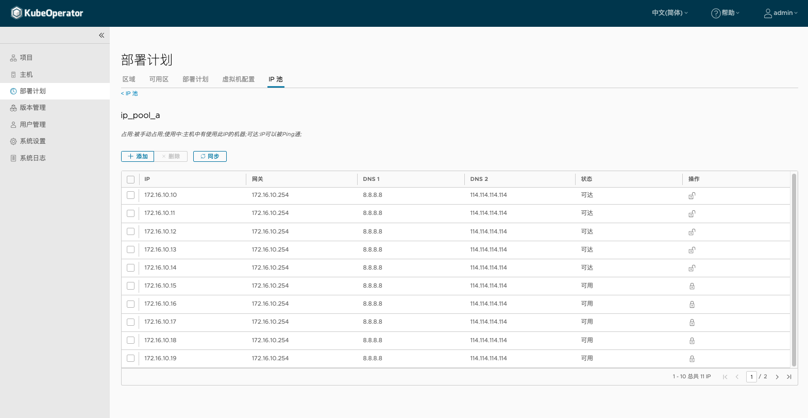

### 虚拟机配置

!!! warning ""
    * 支持添加和修改虚拟机配置（CPU、内存）
    * 默认 small、medium、large、xlarge、2xlarge 和 4xlarge 六种配置

### IP 池

!!! warning ""
    IP 池在创建可用区时使用，池中的 IP 地址将分配给虚拟机

#### 添加 IP 池

!!! warning ""
    创建 IP 池要配置好子网掩码、起止 IP、网关和 DNS 等

#### IP 使用情况

!!! warning ""
    * 列表页点击IP 使用情况可查看IP 池中所有 IP 的状态（可达、可用和占用）
    * 在 IP 池页面，可手动添加 IP 段、同步 IP 状态

### 区域（Region）

!!! warning ""
    * 与公有云中的 Region 概念相似，可以简单理解为地理上的区域
    * 创建区域时，首先选择提供商，目前支持 VMware vSphere、OpenStack 和 FusionCompute
    * 配置参数时，需要提供 vSphere 环境信息，包括 vCenter IP，用户名和密码，单击【验证】可以校验 vSphere 信息是否正确
    * vCenter 用户需要的权限比较高，建议直接绑定带有管理员角色的用户

### 可用区（Zone）

!!! warning ""
    * 与公有云中的 AZ 概念相似，可以简单理解为 Region 中具体的机房
    * 在 vSphere 体系中我们使用不同的 Cluster 或者同个 Cluster 下的不同 Resource Pool 来实现 Zone 的划分
    * 选择可用区配置参数时，需要选择计算集群，资源池，存储类型以及网络适配器等信息，这些信息依赖于 vCenter 环境配置
    * 支持默认模版和自定义模版（默认模版为CentOS 7.6，root 密码默认为 KubeOperator@2019）

!!! warning ""
    * 选择默认模版时，需要将 nexus 仓库中的模版文件上传到 vCenter，成功之后状态变为就绪
    * 初始化过程中需要创建一个名称为 kubeoperator 的文件夹，因此 vCenter 中不能存在名称为 kubeoperator 的虚拟机或者模版

### 部署计划（Plan）

!!! warning ""
    * 用来描述在哪个区域下，哪些可用区中，使用什么样的机器规格，部署什么类型的集群的一个抽象概念
    * 部署计划配置包括选择可用区（可用区可以单选或多选），并设置 Master 节点，Worker 节点的规格

!!! warning ""
    多主多节点集群可以选择多个可用区的部署计划