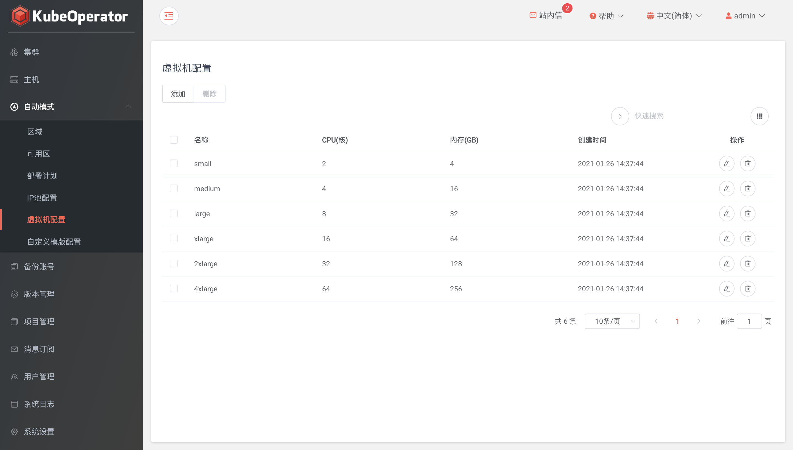

### IP 池配置

!!! warning ""
    IP 池在创建可用区时使用，池中的 IP 地址将分配给虚拟机

#### 添加 IP 池

!!! warning ""
    创建 IP 池要配置好子网掩码、起止 IP、网关和 DNS 等

#### 查看 IP 使用情况

!!! warning ""
    - 列表页点击 IP 使用情况可查看 IP 池中所有 IP 的状态（可达、可用和占用）
    - 在 IP 池页面，可手动添加 IP 段、同步 IP 状态等

### 虚拟机配置

!!! warning ""
    - 支持添加和修改虚拟机配置（CPU、内存）
    - 默认 small、medium、large、xlarge、2xlarge 和 4xlarge 六种配置

### 自定义模版配置

!!! warning ""
    - 支持 VMware vSphere 和 OpenStack 两种 IaaS 云平台

### 区域（Region）

!!! warning ""
    - 与公有云中的 Region 概念相似，可以简单理解为地理上的区域
    - 创建区域时，首先选择提供商，目前支持 VMware vSphere、OpenStack 和 FusionCompute
    - 配置参数时，需要提供 vSphere 环境信息，包括 vCenter 主机，端口，用户名和密码（建议直接绑定带有管理员角色的用户）
    - 单击【获取数据中心】，获取并绑定目标数据中心

### 可用区（Zone）

!!! warning ""
    - 与公有云中的 AZ 概念相似，可以简单理解为 Region 中具体的机房
    - 在 vSphere 体系中我们使用不同的 Cluster 或者同个 Cluster 下的不同 Resource Pool 来实现 Zone 的划分
    - 选择可用区配置参数时，需要选择计算集群，资源池，存储类型以及网络适配器等信息，这些信息依赖于 vCenter 环境配置
    - 支持已有模版、默认模版和自定义模版

### 部署计划（Plan）

!!! warning ""
    - 用来描述在哪个区域下，哪些可用区中，使用什么样的机器规格，部署什么类型的集群的一个抽象概念
    - 部署计划配置包括选择可用区（可用区可以单选或多选），并设置 Master 节点，Worker 节点的规格
    - 多主多节点集群可以选择多个可用区的部署计划

### 默认模版

#### 下载

!!! warning "默认模版"
    - 离线环境下，需要手动上传模版文件至 nexus 仓库
    - 模版文件下载地址如下：
    
    !!! warning "vSphere"
        - ovf: https://kubeoperator.fit2cloud.com/terraform/images/vsphere/kubeoperator_centos_7.6.1810/kubeoperator_centos_7.6.1810.ovf
        - vmdk: https://kubeoperator.fit2cloud.com/terraform/images/vsphere/kubeoperator_centos_7.6.1810/kubeoperator_centos_7.6.1810-1.vmdk
    
    !!! warning "OpenStack"
        - qcow2: https://kubeoperator.fit2cloud.com/terraform/images/openstack/kubeoperator_centos_7.6.1810-1.qcow2
    
    !!! warning "FusionCompute"
        - ovf: https://kubeoperator.fit2cloud.com/terraform/images/fusioncompute/kubeoperator_centos_7.6.1810/kubeoperator_centos_7.6.1810.ovf
        - vhd: https://kubeoperator.fit2cloud.com/terraform/images/fusioncompute/kubeoperator_centos_7.6.1810/kubeoperator_centos_7.6.1810-vda.vhd

#### 上传

!!! warning ""
    - 模版文件需要上传至 binary-k8s-raw 仓库
    - 仓库默认用户名/密码：admin/admin123

    
    
    !!! warning "vSphere"
        - 需上传 ovf 和 vmdk 文件
        - 文件路径：/terraform/images/vsphere/kubeoperator_centos_7.6.1810

        
    
    !!! warning "OpenStack"
        - 需上传 qcow2 文件
        - 文件路径：/terraform/images/openstack

        
    
    !!! warning "FusionCompute"
        - 需上传 ovf 和 vhd 文件
        - 文件路径：/terraform/images/fusioncompute/kubeoperator_centos_7.6.1810

        
