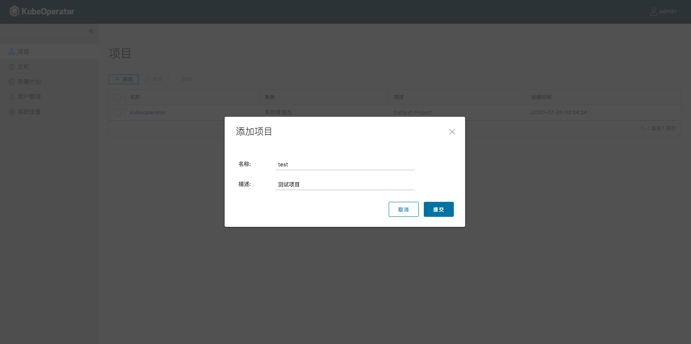
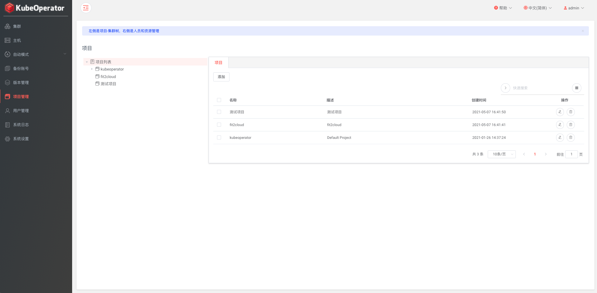
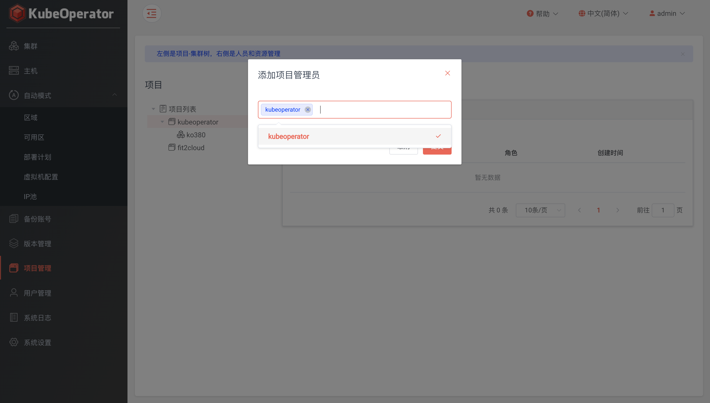
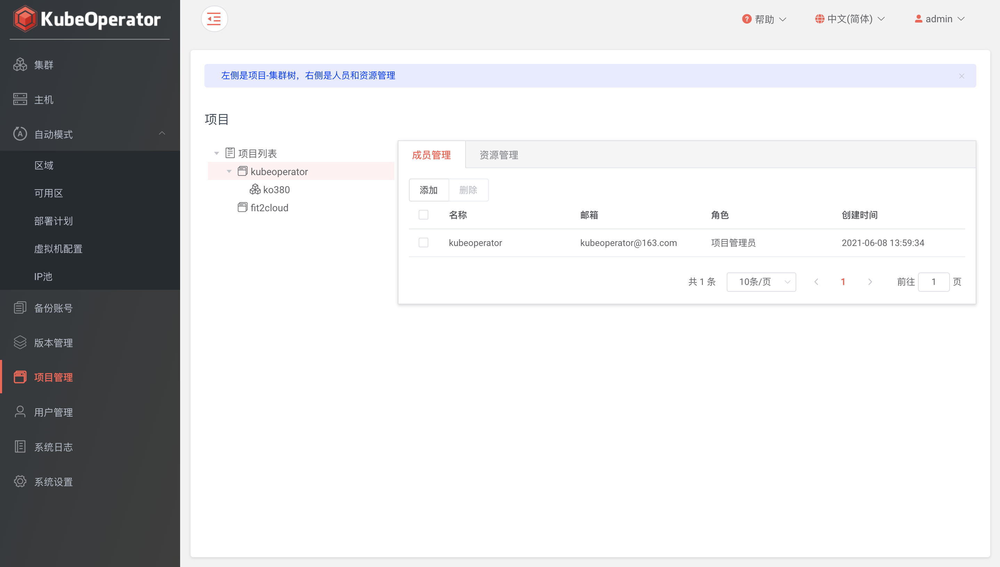
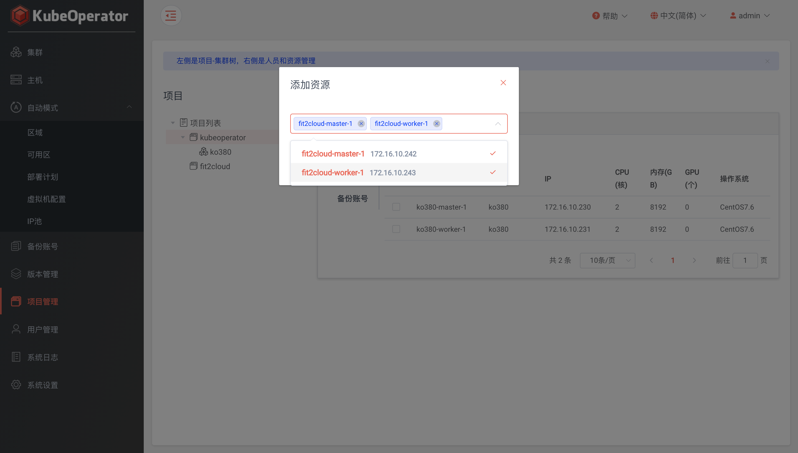
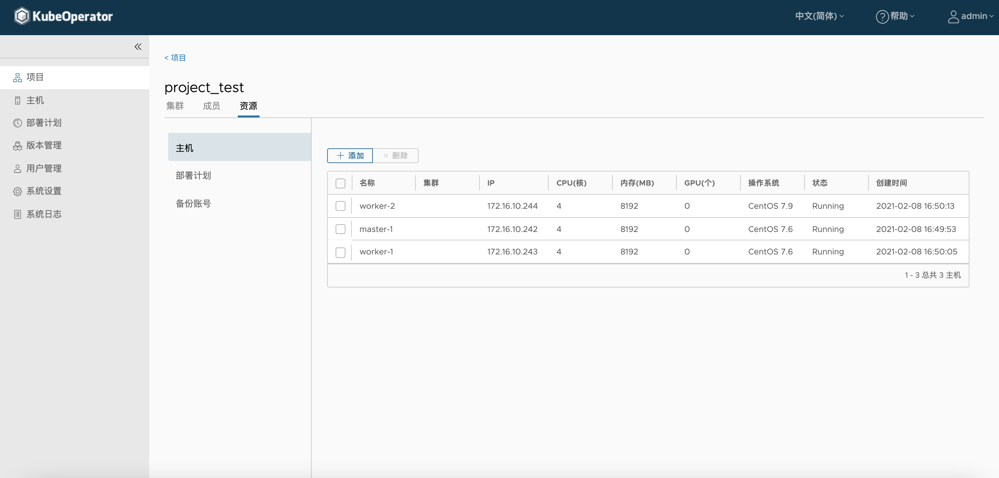

!!! warning ""
    - 系统会初始化一个默认项目（kubeoperator）
    - 系统管理员可以创建项目、添加项目和集群成员、授权项目和集群资源

### 创建项目

!!! warning ""
    不同项目之间的集群除系统管理员以外是不可见的

### 成员管理

!!! warning ""
    - 项目管理员可以查看项目及集群成员、查看项目已授权资源、管理集群授权资源
    - 集群管理员可以管理已授权集群

### 资源管理

!!! warning ""
    - 资源包括主机、部署计划和备份账号
    - 手动模式集群进行扩容操作，要先将主机授权到目标集群
    - 备份账号需要先授权到目标集群才能启用备份

