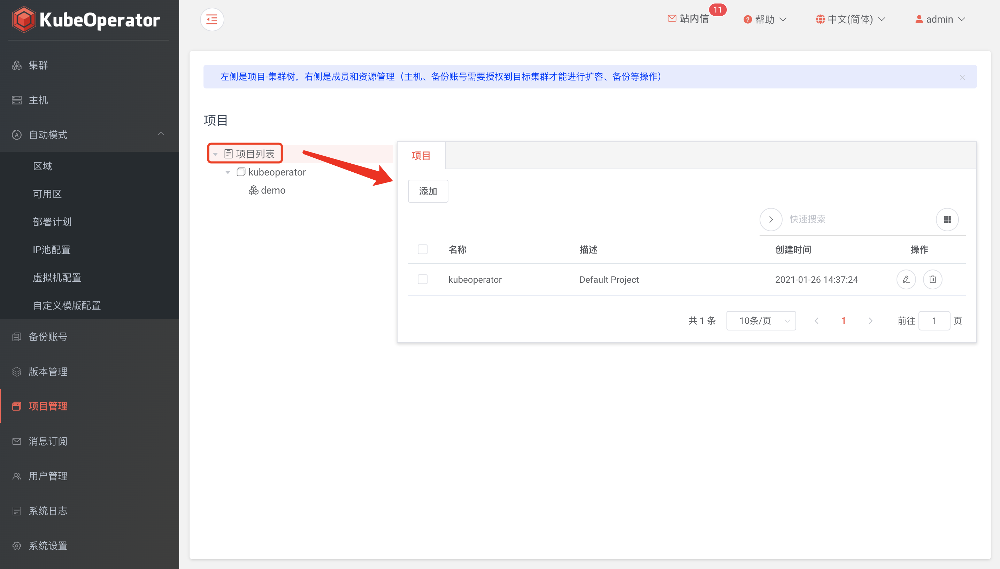

!!! warning ""
    - 系统会初始化一个默认项目: kubeoperator
    - 左侧导航为 项目 - 集群 树（设置成员、资源 和 Dashboard 时，均需区分项目或集群）

### 创建项目

!!! warning ""
    - 系统管理员可以创建项目
    - 不同项目的集群除系统管理员外是不可见的

### 成员管理

!!! warning ""
    管理员可将用户设置为项目管理员或集群管理员

### 资源管理

!!! warning ""
    - 资源包括主机、部署计划和备份账号
    - 手动模式集群进行 Worker 节点扩容时，需要先将主机授权到目标集群
    - 备份账号需要授权到目标集群后才能正常启用集群备份/恢复功能

### Dashboard

!!! warning ""
    - 此处为集群列表 Dashboard 系统登录用户及凭据
    - 若项目和集群同时存在绑定的 Dashboard 用户，则集群绑定用户优先

