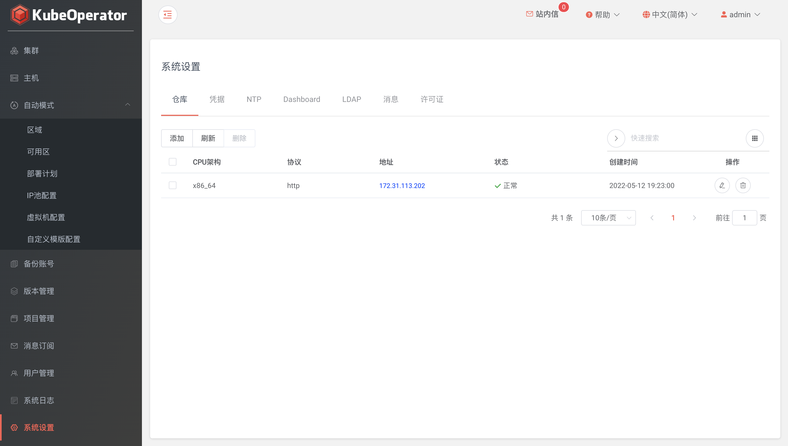

!!! warning "注意"
    在使用 KubeOperator 之前，必须先对 KubeOperator 进行必要的参数设置。这些系统参数将影响到 Kubernetes 集群的安装及相关服务的访问

### 仓库

!!! info ""
    * 仓库协议: 支持 http 和 https，默认 http
    * 仓库 IP: 默认为部署 KubeOperator 的服务器 IP。将使用该 IP 来访问 nexus 仓库
    * CPU架构: 支持 x86_64 和 arm64 ，即两种不同CPU架构的仓库
 
!!! warning "注意"
    如果部署K8S集群时需要K8S节点采用 x86_64 和 arm64 混合部署，则需要添加两个不同CPU架构的仓库

### NTP

!!! info ""
    * NTP Server: 时间同步服务器，默认可以为空。也可以自建或使用公共 NTP Server
    

### 凭据

!!! warning ""
    * 凭据为 KubeOperator 连接主机资产的凭证。支持添加 password 和 privatekey 两种方式的凭据
    * 系统会初始化名称为 kubeoperator 的凭据作为自动模式所创建服务器的密码，默认密码为 KubeOperator@2019

!!! warning ""
    * 密钥方法连接主机举例说明: 在 KubeOperator 主机中首先生成 id_rsa 和 id_rsa.pub 密钥对，将 id_rsa.pub 公钥里面内容添加要连接的目标主机 authorized_keys 文件中，authorized_keys 文件权限需要设置为 600 。然后在 KubeOperator 控制台的【凭据】页面，将开始生成的 id_rsa 私钥文件内容复制到凭据的密钥框中。注意这里的账号需要 root 账号

### 备份

!!! warning ""
    * KubeOperator 目前的备份功能支持四种不同种类的存储，即 AWS S3、aliyun oss、Azure 和 SFTP

### 邮件

!!! warning ""
    * 电子邮件服务器用于向重置密码和消息中心开启邮件功能的用户发送邮件

### 许可

!!! warning ""
    * 支持 license 导入，启用 x-pack 功能

