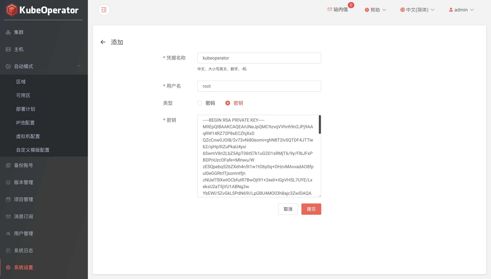

!!! tip ""
    在使用 KubeOperator 之前，必须先对 KubeOperator 进行必要的参数设置。这些系统参数将影响到 Kubernetes 集群的安装及相关服务的访问

### 系统

!!! info "设置系统 IP 和 NTP Server"
    * 系统 IP: 部署 KubeOperator 的服务器 IP。将使用该 IP 来访问 KubeOperator
    * NTP Server: 时间同步服务器，默认可以为空。也可以自建或使用公共 NTP Server

### 凭据
!!! tip ""
    凭据为 KubeOperator 连接主机资产的凭证。支持添加 password 和 privatekey 两种方式的凭据

!!! tip ""
    系统会初始化名称为 kubeoperator 的凭据作为自动模式所创建服务器的密码

!!! tip ""
    密钥方法连接主机举例说明: 在 KubeOperator 主机中首先生成 id_rsa 和 id_rsa.pub 密钥对，将 id_rsa.pub 公钥里面内容添加要连接的目标主机 authorized_keys 文件中，authorized_keys 文件权限需要设置为 600 。然后在 KubeOperator 控制台的【凭据】页面，将开始生成的 id_rsa 私钥文件内容复制到凭据的密钥框中。注意这里的账号需要 root 账号

### 集群备份

!!! tip ""
    KubeOperator 目前的备份功能支持三种不同种类的存储，即 AWS S3、aliyun oss 和 Azure 存储

!!! info "AWS S3"
    输入名称、AccessKey、SecretKey、区域和端点，单击【获取桶】来选择桶名称，建议在 S3 新建一个桶单独使用

### 许可

!!! tip ""
    支持 license 导入，启用 x-pack 功能

