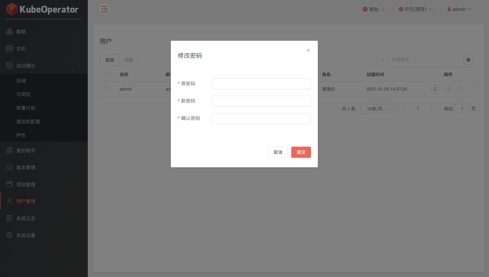

!!! warning "提示"
    - 请妥善保管账号密码，不要将密码泄露给他人
    - 为了提高 KubeOperator 账号的安全性，建议您定期修改密码

    !!! warning "修改建议"
        - 请勿使用简单密码登录，建议密码设为8-30位
        - 密码至少同时包含下列四种字符中的两种：
            - 1） 大写字母
            - 2） 小写字母
            - 3） 数字
            - 4） 非字母数字字符（如！、@、#等）
        - 密码中不得包含登录用户名
        - 密码修改两个月至少修改一次

### 系统管理员

!!! warning ""
    系统管理员用户权限和系统默认账号 admin 权限完全相同

### 普通用户

!!! warning ""
    普通用户初始状态没有任何权限，需要在【项目管理】菜单中将其添加为项目管理员或集群管理员

!!! warning ""
    - admin 管理员可以删除、禁用和开启所有用户
    - 新建系统管理员可以删除、禁用和开启除 admin 账号以外的所有用户，普通用户无上述权限

### 修改密码

!!! warning ""
    点击右上角用户下拉按钮，选择修改密码

