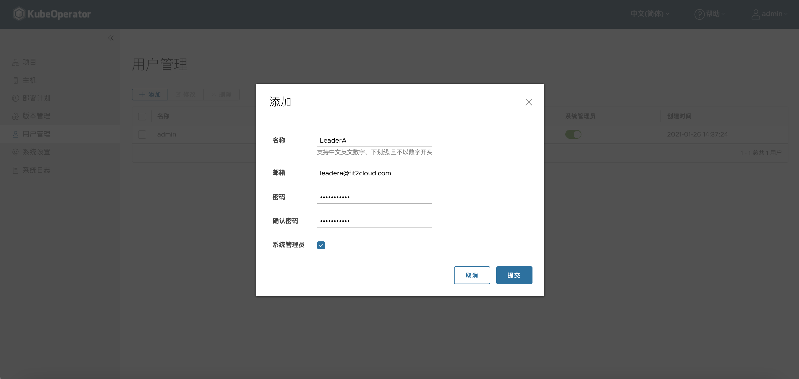

## 用户管理
> 支持添加系统管理员用户和普通用户，普通用户可以根据【项目】选择其作为项目管理员，来实现不同用户对不同项目的使用权限的分级管理。

### 系统管理员用户
> 系统管理员用户权限和系统默认账号 admin 权限完全相同。新建的系统管理员登录系统后可实现所有 admin 权限的操作。

### 普通用户
> 普通用户初始状态没有任何权限。需要在【项目】内添加成为项目管理员。

> 注: admin 管理员可以删除、禁用和开启所有用户，新建系统管理员可以删除、禁用和开启除 admin 账号以外的所有用户，普通用户无上述权限！
