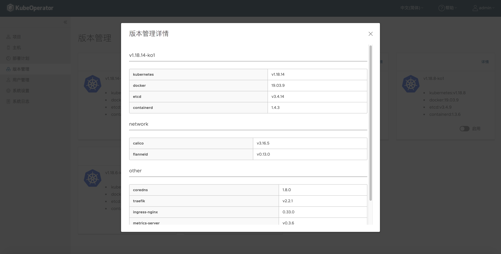

### 版本详情

!!! warning ""
    点击详情按钮，支持查看 Kubernetes 及各个组件的版本信息



### 版本启用

!!! warning ""
    开启目标版本后，才支持创建该版本 k8s 集群


### 离线包

!!! warning ""
    离线包中 Kubernetes 默认只携带最新的两个版本。如果当前是离线环境，需要执行脚本生成旧版本 k8s 离线包，并推送至 nexus 仓库

#### 构建离线包

!!! warning ""
    KubeOperator当前支持的 K8S 版本

<table>
    <thead>
        <tr>
            <th colspan="4" style="text-align:center" >K8S 版本</th>
        </tr>
    </thead>
    <tbody>
        <tr>
            <td>v1.18.4</td>
            <td>v1.18.6</td>
            <td>v1.18.8</td>
            <td>v1.18.10</td>
        </tr>
        <tr>
            <td>v1.18.12</td>
            <td>v1.18.14</td>
            <td>v1.18.15</td>
            <td>v1.18.18</td>
        </tr>
        <tr>
            <td>v1.20.4</td>
            <td>v1.20.6</td>
            <td></td>
            <td></td>
        </tr>
    <tbody>
</table>

!!! warning ""
    执行构建离线包的服务器需要能够访问互联网

=== "KubeOperator 版本 >= v3.6.0"
    !!! warning ""
        ```sh
        # 使用git下载项目源码文件
        git clone https://github.com/KubeOperator/K8SVersionManage.git
        cd K8SVersionManage
        # 切换分支
        git checkout v3.6
        # 例：打包 v1.18.10 版本的离线包。可根据实际情况修改构建对应版本到离线包
        bash build.sh v1.18.10 
        ```
    !!! warning ""
        build 完成后，会生成类似 v1.18.10_offline.tar.gz的离线包

=== "KubeOperator 版本 <= v3.5.0"
    !!! warning ""
        ```sh
        # 使用git下载项目源码文件
        git clone https://github.com/KubeOperator/K8SVersionManage.git
        cd K8SVersionManage
        # 切换到对应版本分支，KubeOperator当前版本小于 v3.5 时，直接切换到 v3.5 分支即可
        git checkout v3.5
        # 例：打包 v1.18.10 版本的离线包 
        bash build.sh v1.18.10
        ```
    !!! warning ""
        build 完成后，会生成类似 v1.18.10_offline.tar.gz的离线包

#### 推送离线包

!!! warning ""
    将生成的目标版本离线包上传至 KubeOperator 部署机，运行上传脚本。

    ```sh
    # 解压离线包
    tar zxvf v1.18.10_offline.tar.gz
    # 执行上传脚本
    cd v1.18.10_offline
    # 例：推送 v1.18.10 版本的离线包 
    bash upload.sh
    ```

!!! warning ""
    - 仓库地址：KubeOperator 默认仓库地址（registry.kubeoperator.io）
    - 仓库用户名：KubeOperator 默认仓库用户名（admin）
    - 仓库密码：KubeOperator 默认仓库密码（admin123）
