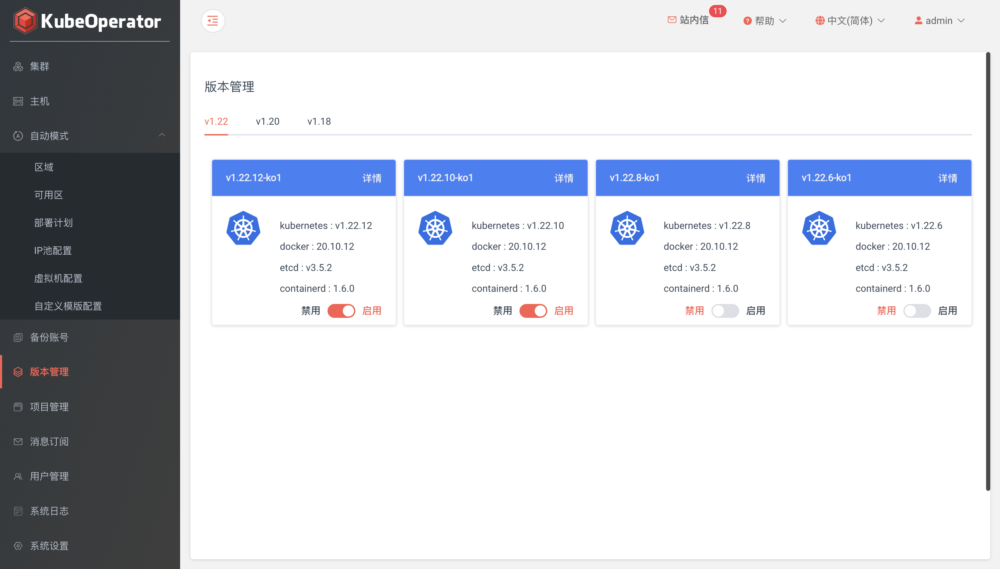
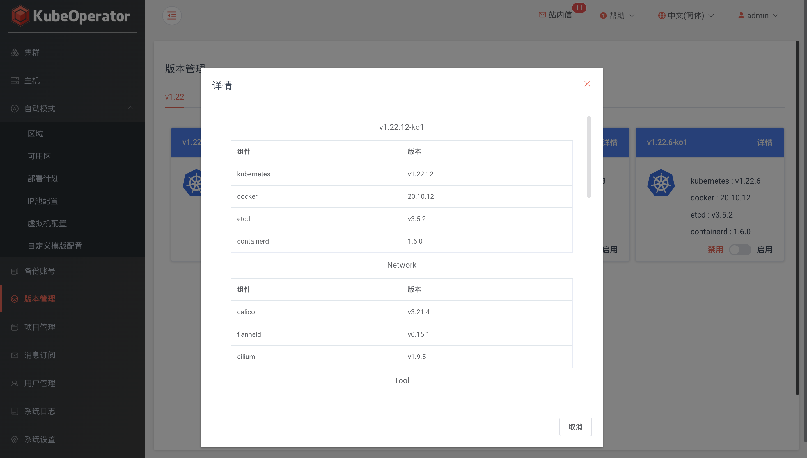

> 用户可以在Web页面查看 Kubernetes 及各个组件的版本信息，方便管理员进行维护和升级

!!! info "核心"
    * [kubernetes](https://github.com/kubernetes/kubernetes) v1.18.4
    * [etcd](https://github.com/coreos/etcd) v3.4.9
    * [docker](https://www.docker.com/) v19.03.9
    * [containerd](https://containerd.io/) v1.3.6
  
!!! info "网络"
    * [calico](https://github.com/projectcalico/calico) v3.14.1
    * [flanneld](https://github.com/coreos/flannel) v0.12.0

!!! info "应用"
    * [coredns](https://github.com/coredns/coredns) v1.6.7
    * [helm](https://github.com/helm/helm) v3.2.4
    * [traefik](https://github.com/containous/traefik) v2.2.1
    * [ingress-nginx](https://github.com/kubernetes/ingress-nginx) v0.32.0
    * [node-problem-detector](https://github.com/kubernetes/node-problem-detector) v0.8.1
    * [metrics-server](https://github.com/kubernetes-sigs/metrics-server) v0.3.6
    * [nfs-provisioner](https://github.com/kubernetes-incubator/external-storage) v3.1.0-k8s1.11
    * [rook-ceph](https://github.com/rook/rook) v1.3.6
    * [rbd-provisioner](https://github.com/kubernetes-incubator/external-storage) v2.1.1-k8s1.11
