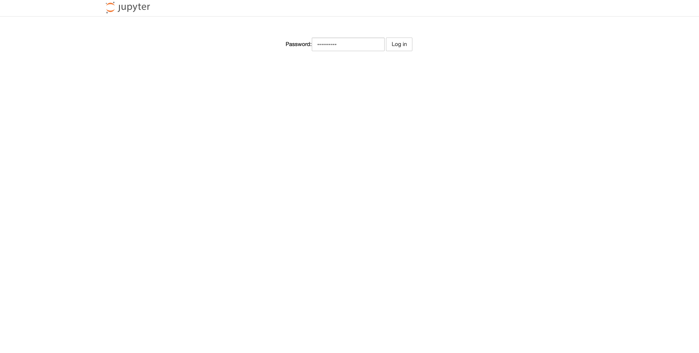
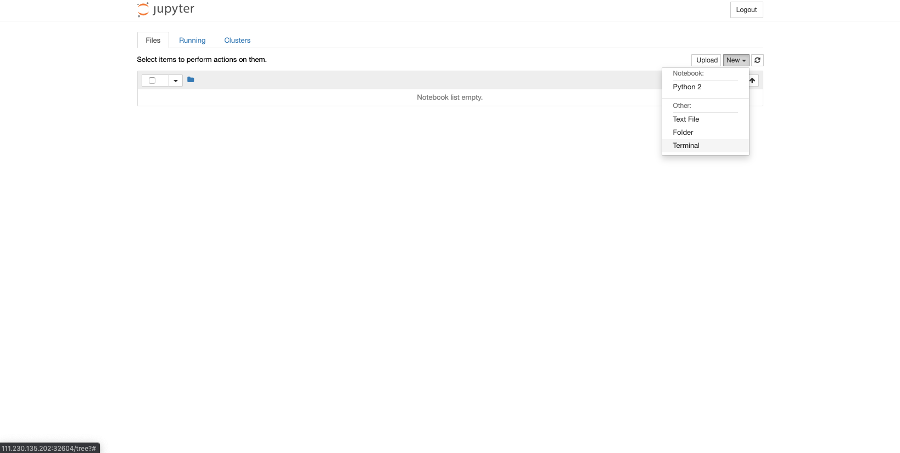
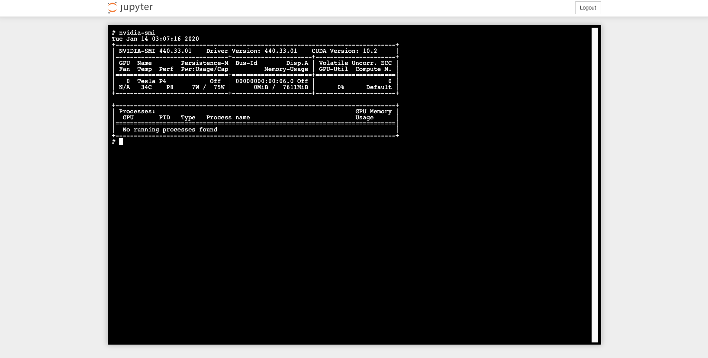

## 1 为什么要在 Kubernetes 上使用 GPU？

除了传统的无状态 Web 应用外，越来越多的数据库 Workload、实时计算 Workload、AI 机器学习 Workload 会跑在 Kubernetes 之上。其中，尤其是 AI 机器学习，天然适合运行在 Kubernetes 之上。对于一些用户来说，其构建 K8s 集群就是专门用来运行机器学习、通用 GPU、高性能计算，以及受益于专用硬件加速器的其他工作负载。

## 2 Kubernetes + Nvidia 标准化方案

## 3 使用 Kubeoperator 部署带有 GPU 的 Kubernetes 集群

### 3.1 先决条件

- 至少一台 Worker 节点拥有 NVIDIA GPU 显卡设备
- Kubernetes 1.6.X: Package >= 1.16.4 
- Kubernetes 1.5.X: Package >= 1.15.7

### 3.2 添加 GPU 主机

截图

### 3.3 创建集群

截图

### 3.4 验证 GPU 调度

```
apiVersion: apps/v1
kind: Deployment
metadata:
  name: nvidia-deployment
spec:
  replicas: 2                # 创建POD副本数
  selector:
    matchLabels:
      name: nvidia-gpu-deploy
  template:
    metadata:
      labels:
        name: nvidia-gpu-deploy

    spec:
      containers:
      - name: cuda-container
        image: ubuntu
        command: ["sleep"]
        args: ["100000"]
        resources:
          limits:
            nvidia.com/gpu: 1       # 使用 GPU 卡的数量
```

```
kubectl apply -f gpu.yml

kubectl get pod

NAME                                READY   STATUS    RESTARTS   AGE
nvidia-deployment-64589d94d-8m6rd   1/1     Running   0          119s  # 获取到显卡 Running
nvidia-deployment-64589d94d-lzfph   0/1     Pending   0          86s   # 未获取到显卡 Pending

kubectl exec -it nvidia-deployment-64589d94d-8m6rd nvidia-smi

Mon Jan 13 08:16:36 2020
+-----------------------------------------------------------------------------+
| NVIDIA-SMI 440.33.01    Driver Version: 440.33.01    CUDA Version: N/A      |
|-------------------------------+----------------------+----------------------+
| GPU  Name        Persistence-M| Bus-Id        Disp.A | Volatile Uncorr. ECC |
| Fan  Temp  Perf  Pwr:Usage/Cap|         Memory-Usage | GPU-Util  Compute M. |
|===============================+======================+======================|
|   0  Tesla P4            Off  | 00000000:00:06.0 Off |                    0 |
| N/A   33C    P8     7W /  75W |      0MiB /  7611MiB |      0%      Default |
+-------------------------------+----------------------+----------------------+

+-----------------------------------------------------------------------------+
| Processes:                                                       GPU Memory |
|  GPU       PID   Type   Process name                             Usage      |
|=============================================================================|
|  No running processes found                                                 |
+-----------------------------------------------------------------------------+
# POD 中已经可以访问到 GPU 设备

```

## 4.Tensorflow on Kubernetes 

### 4.1 关于 Tensorflow

TensorFlow 是一个端到端开源机器学习平台。它拥有一个包含各种工具、库和社区资源的全面灵活生态系统，可以让研究人员推动机器学习领域的先进技术的发展，并让开发者轻松地构建和部署由机器学习提供支持的应用。

### 4.2 安装 Tensorflow

新建文件 tensorflow.yml 并输入一下内容:
```

---
apiVersion: v1
kind: PersistentVolumeClaim
metadata:
  name: tensorflow-pvc
spec:
  accessModes:
  - ReadWriteOnce
  resources:
    requests:
      storage: 10Gi
---
apiVersion: apps/v1
kind: Deployment
metadata:
  name: tensorflow
spec:
  selector:
    matchLabels:
      k8s-app: tensorflow
  replicas: 1
  template:
    metadata:
      labels:
        k8s-app: tensorflow
    spec:
      containers:
      - name: tensorflow
        image: registry.cn-hangzhou.aliyuncs.com/tensorflow-samples/jupyter:1.1.0-devel-gpu
        imagePullPolicy: IfNotPresent
        env:
          - name: PASSWORD
            value: mypassw0rd
        resources:
          limits:
            nvidia.com/gpu: 1
        volumeMounts:
        - mountPath: /usr/local/nvidia
          name: nvidia
      volumes:
        - name: nvidia
          persistentVolumeClaim:
            claimName: tensorflow-pvc
---
apiVersion: v1
kind: Service
metadata:
  name: tensorflow-svc
spec:
  type: NodePort
  ports:
    - name: tensorflow-port
      port: 80
      targetPort: 8888
  selector:
     k8s-app: tensorflow
```

```
kubectl apply -f tensorflow.yml

persistentvolumeclaim/tensorflow-pvc configured
deployment.apps/tensorflow configured
service/tensorflow-svc configured

kubectl get pod

NAME                                   READY   STATUS    RESTARTS   AGE
tensorflow-79c5f4c48c-94l82            1/1     Running   0          101s

kubectl get svc

NAME             TYPE       CLUSTER-IP      EXTERNAL-IP   PORT(S)        AGE
tensorflow-svc   NodePort   179.10.100.67   <none>        80:32604/TCP   2m15s

```
访问 http://NODE_IP:32604 访问 Jupyter




### 4.3 开始一个 Tensorflow 机器学习

#### 4.3.1 打开一个终端





#### 4.3.2 使用 PIP 下载 keras

```
pip install keras==2.0.6
```

#### 4.3.3 代码实现

```
import keras
from tensorflow.python.client import device_lib

# 获取 GPU 信息
num_gpus = sum([1 for d in local_device_protos if d.device_type == 'GPU'])
print("GPU : {}".format(num_gpus))

# 下载 MNIST 数据集
mnist = keras.datasets.mnist
(x_train, y_train), (x_test, y_test) = mnist.load_data()
x_train, x_test = x_train / 255.0, x_test / 255.0


# 将模型的各层堆叠起来，以搭建 keras.Sequential 模型。为训练选择优化器和损失函数：
model = keras.models.Sequential([
  keras.layers.Flatten(input_shape=(28, 28)),
  keras.layers.Dense(128, activation='relu'),
  keras.layers.Dropout(0.2),
  keras.layers.Dense(10, activation='softmax')
])

model.compile(optimizer='adam',
              loss='sparse_categorical_crossentropy',
              metrics=['accuracy'])

# 训练并验证模型
model.fit(x_train, y_train, epochs=5)
model.evaluate(x_test,  y_test, verbose=2)

```
